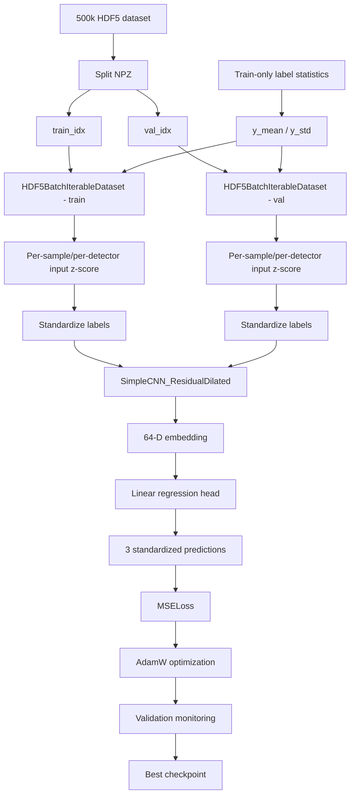
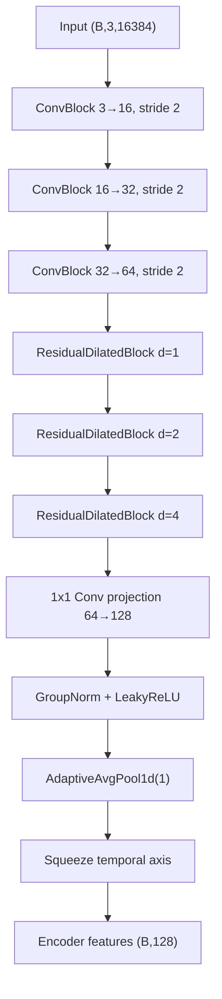
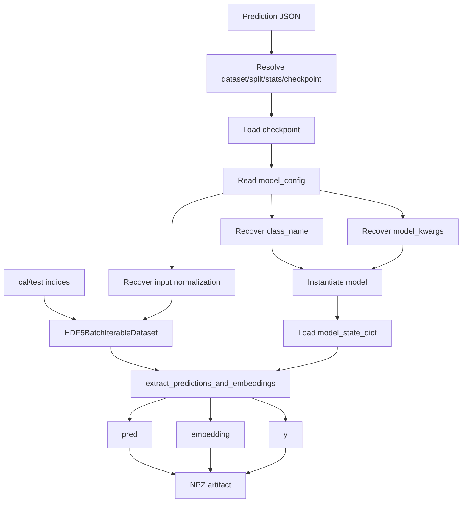

# CNN / ML pipeline manual


> **Codebase manual — closed M10 reference**
>
> This document describes the CNN / machine-learning layer of the `cbc_pe` repository as implemented in the closed M10 baseline.
>
> Reference snapshot:
>
> ```text
> tag:    m10-closed-baseline
> commit: dadf32f77f5c344c3519843e6bd9f0ee0c5baed0
> ```
>
> The goal is to explain how the code works, which components are active in M10, which are alternative infrastructure, which are historical architectures, and how data move from HDF5 storage to predictions and latent embeddings.

---

## 1. Scope

This document covers:

```text
src/models/
├── dataset.py
├── hdf5_batch_dataset.py
├── samplers.py
├── network.py
├── train.py
├── evaluate.py
├── plots.py
└── utils.py
```

and the principal executable scripts:

```text
scripts/train_cnn_hdf5.py
scripts/predict_cnn_hdf5.py
```

Authoritative closed-M10 configs:

```text
configs/experiments/
train_500k_M10_inputzscore_resdilated_emb64_d124_bs256_seed123.json

configs/predictions/
predict_500k_M10_inputzscore_cal_test.json
```

The synthetic generation pipeline is documented separately in:

```text
docs/codebase_manual/modules/synthetic_generation.md
```

---

## 2. High-level responsibility map

```text
DATA ACCESS / NORMALIZATION
│
├── dataset.py
├── hdf5_batch_dataset.py
└── samplers.py
         │
         ▼
MODEL DEFINITION
│
└── network.py
         │
         ▼
OPTIMIZATION
│
├── train.py
└── scripts/train_cnn_hdf5.py
         │
         ▼
INFERENCE / EVALUATION
│
├── evaluate.py
├── plots.py
└── scripts/predict_cnn_hdf5.py
```

`utils.py` contains small shared helpers.

The closed M10 path does **not** use every class in these files. Several architectures and loading strategies remain because they belong to previous controlled experiments and are still useful for reproducibility.

---

## 3. Closed M10 model contract

The authoritative M10 training config defines:

```text
dataset:                 500000 synthetic BBH samples
train / val / cal / test: 400000 / 40000 / 30000 / 30000

input normalization:
    per_sample_per_detector_zscore

model:
    SimpleCNN_ResidualDilated

embedding dimension:     64
residual channels:       64
dilations:               [1, 2, 4]
residual kernel size:    7
dropout_conv:            0.05
dropout_dense:           0.1
GroupNorm groups:        8

loss:                    MSELoss
optimizer:               AdamW
batch size:              256
training seed:           123

data loading:
    hdf5_batch_slices
```

The central conceptual fact is:

> **M10 does not introduce a new CNN architecture relative to M08. M10 retains the residual-dilated M08 family and changes the input-normalization contract.**

```text
M08
    residual-dilated CNN
    no per-sample/per-detector input z-score

M10
    same residual-dilated CNN family
    +
    per-sample/per-detector input z-score
```

---

## 4. End-to-end closed M10 training workflow



Calibration and test data do not participate in gradient-based training or validation-based model selection.

---

## 5. Data contracts entering the CNN

The HDF5 stores:

```text
X: shape (N, C, T)
y: shape (N, D)
```

For closed M10:

```text
N = 500000
C = 3
T = 16384
D = 3
```

Therefore:

```text
X.shape = (500000, 3, 16384)

channel 0 = H1
channel 1 = L1
channel 2 = V1
```

and:

```text
y.shape = (500000, 3)

column 0 = chirp_mass
column 1 = total_mass
column 2 = chi_eff
```

The CNN receives batches as:

```text
(B, C, T)
```

and targets as:

```text
(B, 3)
```

but training targets are in **standardized target space**, not physical units.

---

# 6. `src/models/dataset.py`

## 6.1 Responsibility

Contains:

```text
ArrayRegressionDataset
HDF5RegressionDataset

normalize_input_per_sample_per_detector_zscore()
apply_input_normalization()
```

---

## 6.2 `ArrayRegressionDataset`

A minimal PyTorch `Dataset` for arrays already in RAM.

Constructor:

```python
ArrayRegressionDataset(X, y)
```

It converts both arrays to `torch.float32` and validates:

```text
X.ndim == 3
y.ndim == 2
len(X) == len(y)
```

Expected shapes:

```text
X = (N, C, T)
y = (N, D)
```

Methods:

```text
__len__()      → number of samples
__getitem__()  → X[idx], y[idx]
```

Status:

```text
ACTIVE UTILITY / SMALL-DATA PATH
NOT THE PRIMARY CLOSED-M10 TRAINING LOADER
```

---

## 6.3 `HDF5RegressionDataset`

Provides lazy sample-wise HDF5 access.

Constructor state:

```text
h5_path
indices
y_mean
y_std
input_normalization
_file
x_shape
y_shape
```

### Split position vs physical HDF5 index

This distinction is critical.

The `idx` received by `__getitem__()` is a **position within the split**, not necessarily the physical HDF5 row.

```python
real_idx = int(self.indices[idx])
```

Example:

```text
split position = 17
physical HDF5 row = 314827
```

The actual read is then:

```text
X = f["X"][314827]
y = f["y"][314827]
```

This allows train/val/cal/test to be represented only by index arrays.

### Lazy file opening

`_get_file()` opens the HDF5 only when required. This is important with PyTorch `DataLoader` workers because it avoids relying on a file handle created before worker processes begin.

### `__getitem__()` workflow

```text
split position
    ↓
resolve physical HDF5 index
    ↓
read one X sample
    ↓
read one y sample
    ↓
apply configured input normalization
    ↓
standardize target labels
    ↓
convert to torch tensors
```

Input transformation:

```python
X = apply_input_normalization(
    X,
    self.input_normalization,
)
```

Target transformation:

```python
y = (y - self.y_mean) / (self.y_std + 1e-8)
```

when label statistics are available.

---

# 7. M10 input normalization

Canonical single-sample function:

```python
normalize_input_per_sample_per_detector_zscore(
    X,
    eps=1e-6,
)
```

Expected input:

```text
X.shape = (C, T)
```

For every detector independently:

\[
\mu_c = \frac{1}{T}\sum_t X_{c,t}
\]

\[
\sigma_c =
\sqrt{\frac{1}{T}\sum_t (X_{c,t}-\mu_c)^2}
\]

\[
X'_{c,t}
=
\frac{X_{c,t}-\mu_c}
{\sigma_c+\epsilon}
\]

with closed-M10:

\[
\epsilon = 10^{-6}.
\]

Thus:

```text
sample 0
├── z-score H1
├── z-score L1
└── z-score V1

sample 1
├── z-score H1
├── z-score L1
└── z-score V1
```

No global training-set statistics are used for `X`.

### `apply_input_normalization()`

Interprets a config dictionary such as:

```json
{
  "enabled": true,
  "mode": "per_sample_per_detector_zscore",
  "eps": 1e-6
}
```

Behavior:

```text
None / disabled
    → unchanged X

mode = per_sample_per_detector_zscore
    → M10 z-score

unknown mode
    → ValueError
```

### Scientific interpretation

The transformation removes:

```text
temporal mean
absolute per-channel scale
```

for each sample/detector.

```text
[SCIENTIFIC ASSUMPTION]

M10 intentionally discards the absolute per-sample/per-detector
amplitude scale through z-score normalization.
```

This was introduced to mitigate the synthetic-to-real detector-scale mismatch observed with M08.

---

# 8. Label standardization

The HDF5 stores physical labels, but the CNN target is:

\[
y_\mathrm{std}
=
\frac{y_\mathrm{phys}-\mu_\mathrm{train}}
{\sigma_\mathrm{train}}.
\]

The statistics are computed from the **training split only**.

Critical distinction:

```text
X normalization
    per sample
    per detector
    self-derived sample statistics

y standardization
    global train-only statistics
    one mean/std per regression target
```

These operations must never be conflated.

---

# 9. `src/models/hdf5_batch_dataset.py`

## 9.1 Responsibility

Contains:

```text
normalize_batch_per_sample_per_detector_zscore()
apply_input_normalization_to_batch()
HDF5BatchIterableDataset
```

Its purpose is HDF5 I/O efficiency at large scale.

### Batch-wise M10 normalization

Expected:

```text
X.shape = (B, C, T)
```

The implementation computes:

```python
mean = X.mean(axis=2, keepdims=True)
std  = X.std(axis=2, keepdims=True)
```

so it is still independent for each sample × detector.

The repository has tests verifying equivalence between:

```text
single-sample normalization
batch normalization
closed M10 notebook formula
```

This is a critical regression test because input normalization is the defining M10 methodological change.

---

## 9.2 `HDF5BatchIterableDataset`

Optimized for reading complete HDF5 batches.

Important constructor parameters:

```text
h5_path
indices
y_mean / y_std
input_normalization

batch_size
drop_last
seed

shuffle_batches
shuffle_within_batch

max_slice_overread
```

### Physical-index sorting

```python
self.sorted_indices = np.sort(self.indices)
```

A random split may contain physically distant rows. Sorting allows nearby rows to be read together.

### Batch-level shuffling

Closed M10 uses:

```text
shuffle_batches      = true
shuffle_within_batch = false
```

Thus nearby rows stay grouped, but the order of batches changes each epoch.

### Epoch-dependent order

`set_epoch(epoch)` changes the internal epoch. The RNG uses:

```text
seed + epoch
```

so batch order is reproducible conditional on seed and epoch.

### Multiple workers

`_batch_ids_for_worker()` partitions batch IDs among DataLoader workers. Every worker opens its own HDF5 handle in `__iter__()`.

### `max_slice_overread`

For a requested batch, define:

\[
\mathrm{overread}
=
\frac{\mathrm{contiguous\ span}}
{N_\mathrm{requested}}.
\]

If:

```text
overread <= max_slice_overread
```

the loader reads one contiguous slice and selects needed rows.

Otherwise it uses sorted fancy indexing.

Closed M10:

```text
max_slice_overread = 4.0
```

### Output

The iterable dataset returns already assembled batches:

```text
X_batch: torch.float32, (B,C,T)
y_batch: torch.float32, (B,3)
```

so the DataLoader is used with:

```python
batch_size=None
```

---

# 10. Which loader does closed M10 use?

The config sets:

```text
data_loading_mode = hdf5_batch_slices
```

Therefore train and validation use:

```text
HDF5BatchIterableDataset
```

as the primary path.

Training:

```text
batch_size          = 256
shuffle_batches     = true
shuffle_within_batch = false
drop_last           = true
```

Validation:

```text
batch_size          = 256
shuffle_batches     = false
shuffle_within_batch = false
drop_last           = false
```

`HDF5RegressionDataset` remains active for sanity checks and alternative loading modes.

---

# 11. `src/models/samplers.py`

## `SortedBlockBatchSampler`

Alternative HDF5 locality strategy for `HDF5RegressionDataset`.

Conceptually:

```text
HDF5RegressionDataset
        +
SortedBlockBatchSampler
        ↓
locality-aware sample-wise DataLoader
```

It:

1. sorts dataset positions by physical HDF5 index;
2. groups nearby positions into batches;
3. shuffles batch order per epoch;
4. optionally shuffles inside batches.

Status:

```text
ACTIVE ALTERNATIVE I/O STRATEGY
NOT USED BY CLOSED M10
```

Closed M10 uses `HDF5BatchIterableDataset` instead.

---

# 12. Training sanity check

Before expensive training, `scripts/train_cnn_hdf5.py` builds a deterministic sample-wise loader from `HDF5RegressionDataset`.

It checks:

```text
X shape
y shape
finite X
finite y
target means/stds
per-sample/channel X means/stds
```

When M10 input normalization is enabled, it explicitly requires:

```text
channel mean ≈ 0
channel std  ≈ 1
```

within tolerance.

This is an important guardrail against accidentally launching a long run with a broken normalization path.


# 13. `src/models/network.py`

## 13.1 Responsibility

This module contains:

```text
reusable neural-network building blocks
historical CNN architectures
closed M08/M10 residual-dilated architecture
attention experiment variants
```

The file therefore mixes **active model code** and **historical experiment implementations**. That is useful for reproducibility, but it increases cognitive load.

---

## 13.2 `ConvBlock`

Architecture:

```text
Conv1d
  ↓
GroupNorm
  ↓
LeakyReLU
  ↓
Dropout
```

Typical constructor parameters:

```text
kernel_size = 16
stride      = 2
dropout     = 0.05
num_groups  = 8
```

The stride-2 convolutions both extract features and reduce temporal resolution.

`GroupNorm` is internal network normalization and is distinct from the M10 input z-score performed before the model.

---

## 13.3 `ResidualDilatedBlock`

Purpose: increase temporal receptive field while preserving:

```text
batch size
channel count
temporal length
```

Contract:

```text
(B,C,T) → (B,C,T)
```

Architecture:

```text
input ───────────────────────────────┐
  │                                  │
  ▼                                  │
Dilated Conv1d                        │
  ↓                                  │
GroupNorm                            │
  ↓                                  │
LeakyReLU                            │
  ↓                                  │
Dropout                              │
  ↓                                  │
Dilated Conv1d                        │
  ↓                                  │
GroupNorm                            │
  │                                  │
  └──────────── add residual ◄────────┘
                    ↓
                LeakyReLU
```

Conceptually:

\[
x_\mathrm{out} = \phi(x + F(x)).
\]

### Dilation

With a conceptual kernel width 7:

```text
dilation 1:
x x x x x x x

dilation 2:
x . x . x . x . x . x . x

dilation 4:
x ... x ... x ... x ... x ... x ... x
```

The receptive field grows without the same parameter increase as a physically wider kernel.

Closed M10 uses:

```text
dilations = [1,2,4]
```

---

## 13.4 `TemporalAttentionPool1d`

Single-slot content-based temporal attention.

Input:

```text
(B,C,T)
```

A learned score network produces:

```text
(B,1,T)
```

and softmax normalizes over time.

The pooled feature is:

\[
z_c = \sum_t \alpha_t x_{c,t},
\qquad
\sum_t \alpha_t = 1.
\]

Output:

```text
(B,C,1)
```

Status:

```text
AVAILABLE BUILDING BLOCK
NOT USED BY CLOSED M10
```

---

## 13.5 `MultiSlotTemporalAttentionPool1d`

Generalizes attention to `K` learned slots.

```text
input:
(B,C,T)

attention:
(B,K,T)

output:
(B,C,K)
```

Each slot learns its own temporal probability distribution.

Used by the M09 multi-attention experiment, not by M10.

---

# 14. Historical architecture classes

## 14.1 `SimpleCNN_Baseline`

Baseline shared CNN:

```text
(B,3,T)
  ↓
ConvBlock 3→16
  ↓
ConvBlock 16→32
  ↓
ConvBlock 32→64
  ↓
ConvBlock 64→128
  ↓
AdaptiveAvgPool1d(1)
  ↓
(B,128)
  ↓
embedding MLP
  ↓
embedding
  ↓
Linear regression head
  ↓
(B,3)
```

Public interface:

```text
encode(x)
embed(x)
forward(x)
forward(x, return_embedding=True)
```

---

## 14.2 `SimpleCNN_Pool`

Retains coarse temporal information using:

```text
AdaptiveAvgPool1d(pool_size)
```

instead of collapsing directly to one temporal bin.

Historical architecture-search documentation confirms:

```text
M01 → SimpleCNN_Pool, pool_size=1
M02 → SimpleCNN_Pool, pool_size=4
```

Neither clearly outperformed the M00 baseline in that 100k architecture-search phase.

---

## 14.3 `SimpleCNN_PoolDeep`

Uses pooled temporal information plus a deeper dense embedding stack:

```text
128 * pool_size
   ↓
512
   ↓
256
   ↓
128
   ↓
embedding_dim
```

Historical documented mapping:

```text
M04 → SimpleCNN_PoolDeep
```

This run improved some mass behavior but did not establish a sufficiently clear global advantage.

---

## 14.4 `WideCNN_Pool`

Tests whether the convolutional feature extractor is the bottleneck.

Channel progression:

```text
3 → 32 → 64 → 128 → 256
```

Historical documented mapping:

```text
M06 → WideCNN_Pool
```

Architecture-search notes report faster convergence but poorer generalization than the strongest earlier candidates.

---

## 14.5 `SimpleCNN_MultiHead`

Keeps a shared encoder and embedding, then uses separate target-specific heads:

```text
             shared embedding
                  │
       ┌──────────┼──────────┐
       ▼          ▼          ▼
  chirp head  total head  chi_eff head
       │          │          │
       └──────────┼──────────┘
                  ▼
               (B,3)
```

Status:

```text
HISTORICAL ARCHITECTURE
NOT USED BY CLOSED M10
```

### Experiment-ID note

Repository configuration naming confirms:

```text
M07 = SimpleCNN_MultiHead
```

This mapping is therefore treated as verified historical experiment metadata.

---

# 15. `SimpleCNN_ResidualDilated`

## 15.1 Status

```text
ACTIVE CLOSED-M10 ARCHITECTURE
```

This is the model family established in M08 and retained in M10.

Closed M10 parameters:

```text
n_detectors          = 3
n_outputs            = 3

embedding_dim        = 64
residual_channels    = 64
dilations            = [1,2,4]
residual_kernel_size = 7

dropout_conv         = 0.05
dropout_dense        = 0.1
num_groups           = 8
```

The implementation currently requires:

```text
residual_channels == 64
```

because the third strided block outputs 64 channels.

---

## 15.2 Encoder



The three strided blocks perform the main temporal downsampling.

The residual-dilated blocks increase temporal context without further downsampling.

The 1×1 projection changes channels:

```text
64 → 128
```

without changing temporal length.

Global average pooling collapses the temporal dimension.

---

## 15.3 Embedding

After encoder output:

```text
(B,128)
```

the embedding stack is:

```text
Linear 128→64
  ↓
LeakyReLU
  ↓
Dropout
  ↓
Linear 64→64
  ↓
LeakyReLU
```

Therefore:

```text
embedding.shape = (B,64)
```

This 64-dimensional representation is scientifically important because it is later reused by difficulty-based Mondrian conformal calibration.

```text
GW input
   ↓
CNN encoder
   ↓
64-D embedding
   ├─────────────► regression head
   └─────────────► kNN difficulty estimation
```

---

## 15.4 Regression head

Final layer:

```text
Linear 64 → 3
```

No output activation.

The three outputs correspond to standardized:

```text
chirp_mass
total_mass
chi_eff
```

The raw network prediction is **not in physical units**.

---

## 15.5 Public model interface

```text
encode(x)
    → (B,128) encoder features

embed(x)
    → (B,64) latent embedding

forward(x)
    → (B,3) predictions

forward(x, return_embedding=True)
    → predictions, embedding
```

This common interface enables generic downstream evaluation and conformal extraction.

---

# 16. `SimpleCNN_ResidualDilatedMultiAttention`

Historical M09 variant.

It inherits the residual-dilated encoder but replaces global average pooling with multi-slot attention:

```text
residual-dilated encoder
        ↓
(B,128,T)
        ↓
multi-slot attention
        ↓
(B,128,K)
        ↓
slot projection
        ↓
(B,slot_dim,K)
        ↓
flatten
        ↓
(B,128)
        ↓
inherited embedding
```

Default controlled-comparison values:

```text
K        = 4
slot_dim = 32

K * slot_dim = 128
```

The code enforces:

```text
attention_slots * slot_dim == 128
```

to preserve the inherited M08 embedding input dimensionality.

Status:

```text
HISTORICAL M09 ARCHITECTURE
NOT USED BY CLOSED M10
```

---

# 17. Architecture lineage

| Experiment | Model class | Main change | Status relative to M10 |
|---|---|---|---|
| M00 | `SimpleCNN_Baseline` | baseline shared CNN + global average pooling | historical |
| M01 | `SimpleCNN_Pool` | pool size 1 / larger embedding experiment | historical |
| M02 | `SimpleCNN_Pool` | pool size 4; retain coarse temporal bins | historical |
| M04 | `SimpleCNN_PoolDeep` | deeper dense embedding stack | historical |
| M06 | `WideCNN_Pool` | wider convolutional encoder | historical |
| M07 | `SimpleCNN_MultiHead` | target-specific heads | historical |
| M08 | `SimpleCNN_ResidualDilated` | residual dilated temporal processing | architecture reused by M10 |
| M09 | `SimpleCNN_ResidualDilatedMultiAttention` | multi-slot attention pooling | historical |
| M10 | `SimpleCNN_ResidualDilated` | M08 architecture + input z-score | **closed active baseline** |

The key interpretation is:

> **M10 is a preprocessing/domain-transfer experiment built on M08's selected architecture, not another architecture-search step.**

---

# 18. `src/models/train.py`

Contains:

```text
train_one_epoch()
validate_one_epoch()
train_model()
```

## 18.1 `train_one_epoch()`

Standard PyTorch training loop:

```text
model.train()
    ↓
for X_batch, y_batch:
    move to device
    optimizer.zero_grad()
    pred = model(X_batch)
    loss = loss_fn(pred, y_batch)
    loss.backward()
    optimizer.step()
```

Loss is accumulated weighted by batch size and converted to mean loss per sample.

---

## 18.2 `validate_one_epoch()`

Uses:

```text
@torch.no_grad()
model.eval()
```

No gradients or parameter updates.

Validation loss is used for model selection and early stopping.

---

## 18.3 `train_model()`

Optimizer:

```text
AdamW
```

Closed M10:

```text
learning_rate = 3e-4
weight_decay  = 3e-4
```

Loss implementation:

```python
nn.MSELoss()
```

Closed M10 config also says `MSELoss`, so the closed baseline is internally consistent.

### Configuration / maintenance risk

The JSON `training.loss` field does **not** dynamically instantiate the loss function.

```text
[CONFIGURATION RISK]

Changing only:

    "loss": "SmoothL1Loss"

in a config would not change train_model().

The implementation would still use nn.MSELoss()
unless the code were changed.
```

This is not an M10 scientific bug; it is a future-maintenance hazard.

---

# 19. Early stopping and best checkpoint

Tracked state:

```text
best_val_loss
epochs_without_improvement
best_checkpoint
```

Whenever validation improves, a deep copy is stored.

Closed M10:

```text
max_epochs = 250
patience   = 25
```

Training stops after `patience` epochs without improvement.

The best checkpoint stores:

```text
epoch
model_state_dict
optimizer_state_dict

train_loss
best_val_loss

y_mean
y_std

model_config

training_config:
    seed
    batch_size
    max_epochs
    patience
    learning_rate
    weight_decay
```

and later also:

```text
elapsed_seconds
history
```

The checkpoint is therefore much more than a weights file.

---

# 20. `scripts/train_cnn_hdf5.py`

This is the high-level training orchestrator.

Workflow:

```text
parse CLI
  ↓
load JSON config
  ↓
resolve project/data roots
  ↓
resolve dataset/split/stats
  ↓
inspect HDF5
  ↓
load train/val/cal/test indices
  ↓
load train-only y_mean/y_std
  ↓
validate split disjointness
  ↓
construct datasets/loaders
  ↓
normalization sanity check
  ↓
instantiate configured model
  ↓
train
  ↓
restore best weights
  ↓
save checkpoint
  ↓
save history
```

### Split leakage guard

Every pair of available splits is checked with `np.intersect1d`. Any overlap raises an error.

### HDF5 completeness checks

The script verifies:

```text
X exists
y exists
shapes are coherent
num_written matches
dataset_status == complete
```

when those attributes are available.

### Loading modes supported

Path A:

```text
hdf5_batch / hdf5_batch_slices
→ HDF5BatchIterableDataset
```

Path B:

```text
sorted_block batch sampler
→ HDF5RegressionDataset + SortedBlockBatchSampler
```

Path C:

```text
default
→ HDF5RegressionDataset + normal DataLoader
```

Closed M10 follows Path A.

### Model construction

The script reads:

```text
class_name
architecture_name
model kwargs
```

and dynamically instantiates the model.

It also records a `full_model_config` containing:

```text
architecture
class_name
dataset_id
dataset/split/stats paths
n_samples
n_detectors
signal_length
n_outputs
label_names
model_kwargs
GroupNorm
input_normalization
loss
split sizes
training seed
split seed
```

This object is stored in the checkpoint and later drives prediction reconstruction.


# 21. `src/models/utils.py`

## 21.1 `set_seed()`

Sets seeds for:

```text
Python random
NumPy
PyTorch CPU
PyTorch CUDA
```

However the code also sets:

```python
torch.backends.cudnn.deterministic = False
torch.backends.cudnn.benchmark = True
```

Therefore:

```text
[REPRODUCIBILITY NOTE]

The workflow is seeded but does not request strict
bitwise-deterministic cuDNN behavior.
```

Same-seed reruns are controlled at the experiment level, but exact bit-for-bit equality is not guaranteed across all hardware/backend conditions.

## 21.2 `summarize_prediction_file()`

Loads a prediction artifact and computes compact validation metrics through `regression_metrics()`.

It returns:

```text
global validation MSE
global validation MAE

per target:
    MSE
    MAE
    R2
```

This is a comparison convenience helper.

---

# 22. `src/models/evaluate.py`

Main functions:

```text
predict_on_loader()
regression_metrics()
compute_error_metrics()
evaluate_global_mse()
extract_predictions_and_embeddings()
inverse_standardize()
```

## 22.1 `predict_on_loader()`

Runs inference under:

```text
@torch.no_grad()
model.eval()
```

and returns:

```text
predictions
targets
```

as NumPy arrays.

## 22.2 `extract_predictions_and_embeddings()`

Calls:

```python
pred, emb = model(
    X_batch,
    return_embedding=True,
)
```

and accumulates:

```text
predictions
embeddings
targets
```

Return contract:

```text
pred : (N,3)
emb  : (N,embedding_dim)
y    : (N,3)
```

Closed M10:

```text
embedding_dim = 64
```

This function is central to the Mondrian workflow because difficulty-based calibration consumes the embedding.

---

# 23. Standardized vs physical evaluation

Evaluation functions do not know which unit system they receive.

If inputs are standardized, metrics are standardized.

If the caller first inverse-transforms them, metrics are physical.

`inverse_standardize()` implements:

\[
y_\mathrm{physical}
=
y_\mathrm{standardized}
\sigma
+
\mu.
\]

Therefore the caller must keep track of whether an array is in:

```text
standardized target space
or
physical target space
```

This is why optimization loss and scientific physical metrics are distinct quantities.

---

# 24. `regression_metrics()`

Residual convention:

\[
r = y_\mathrm{pred} - y_\mathrm{true}.
\]

Per-target outputs:

```text
MSE
RMSE
MAE
bias
median_abs_error
residual_std
R2
```

Interpretation:

```text
positive bias
    predictions high on average

negative bias
    predictions low on average
```

Returns one pandas DataFrame row per target.

`compute_error_metrics()` is a simpler helper returning global/per-label MSE and MAE.

---

# 25. `src/models/plots.py`

Classification:

```text
ACTIVE ANALYSIS / PRESENTATION UTILITY
NOT PART OF THE SCIENTIFIC TRANSFORMATION CHAIN
```

It contains diagnostic visualization helpers but does not change predictions or training.

Main functions:

```text
plot_pred_vs_true()
plot_pred_vs_true_density()

plot_residuals()
plot_residual_vs_true()
plot_residual_vs_true_density()

plot_mean_abs_error_vs_true_pred()

plot_abs_error_vs_quantity()
plot_abs_error_vs_quantity_density()

plot_binned_error_vs_quantity()
```

## 25.1 Prediction-vs-truth plots

Useful for detecting:

```text
bias
compression toward conditional mean
outliers
nonlinear response
boundary effects
```

Density variants are designed for large datasets where scatter plots saturate.

## 25.2 Residual diagnostics

Residuals use:

\[
r = y_\mathrm{pred}-y_\mathrm{true}.
\]

Residual-vs-truth plots are particularly useful for observing:

```text
regression to the mean
heteroscedasticity
target-dependent bias
boundary behavior
```

## 25.3 Error-vs-quantity diagnostics

The plotting helpers can compare error against arbitrary quantities, for example:

```text
network SNR
distance
true mass
mass ratio
chi_eff
```

The binned version reports:

```text
mean absolute error
median absolute error
count per bin
```

and is useful for identifying performance variations hidden by global metrics.

---

# 26. `scripts/predict_cnn_hdf5.py`

This script reconstructs a trained model and generates reusable prediction/embedding artifacts.

Closed M10 config requests:

```text
splits = [cal, test]
batch_size = 512
data_loading_mode = hdf5_batch_slices
```

Workflow:



---

# 27. Checkpoint-driven reconstruction

Prediction reads:

```text
checkpoint["model_config"]
```

then extracts:

```text
class_name
model_kwargs
```

and rebuilds the model dynamically before loading:

```text
model_state_dict
```

This means the trained architecture travels with the checkpoint.

A standalone `state_dict` should therefore not be treated as the complete experiment artifact.

---

# 28. Input-normalization recovery during prediction

Priority:

```text
explicit prediction-config override
        ↓
checkpoint model_config
        ↓
disabled fallback
```

Closed M10 prediction does not need to restate the z-score because it is preserved in the checkpoint model metadata.

This reduces the risk of evaluating M10 without the preprocessing that defines it.

---

# 29. Closed M10 prediction artifact

Output:

```text
m10_inputzscore_500k_cal_test_predictions_embeddings.npz
```

For each split:

```text
pred_<split>
emb_<split>
y_<split>
idx_<split>
```

Specifically:

```text
pred_cal
emb_cal
y_cal
idx_cal

pred_test
emb_test
y_test
idx_test
```

It also stores:

```text
y_mean
y_std
label_names

checkpoint_file
dataset_path
split_path
label_stats_path

model_config
input_normalization
available_splits
```

Therefore the NPZ contains both scientific arrays and important provenance/normalization metadata.

---

# 30. Critical prediction-ordering contract

Because `HDF5BatchIterableDataset` sorts physical HDF5 indices, batch-mode predictions are emitted in:

```text
sorted physical-index order
```

not necessarily the original order stored in the split NPZ.

The prediction script therefore stores:

```text
idx_cal
idx_test
```

in that same sorted order.

```text
[CRITICAL DATA CONTRACT]

Never assume that:

    pred_test[i]

corresponds to:

    original_test_idx[i]

without checking ordering.

Use the saved idx_test / idx_cal arrays when mapping
predictions back to original HDF5 rows.
```

This is one of the most important bookkeeping rules in the CNN pipeline.

---

# 31. Relationship between CNN and Mondrian

The prediction artifact exposes two scientifically distinct representations.

Point prediction:

```text
pred_cal
pred_test
```

used directly as estimates and by prediction-based taxonomies.

Latent representation:

```text
emb_cal
emb_test
```

used by difficulty-based methods.

```text
M10 input
    ↓
Residual-dilated CNN
    ↓
64-D embedding
    ├───────────────┐
    ▼               ▼
regression head   kNN difficulty
    │               │
prediction          difficulty
    │               │
    └───────┬───────┘
            ▼
      Mondrian conformal
```

Embedding extraction is therefore part of the reproducible scientific pipeline, not only an exploratory visualization step.

---

# 32. Active vs historical classification

## Closed-M10 active path

```text
src/models/dataset.py
    HDF5RegressionDataset
    input-normalization helpers

src/models/hdf5_batch_dataset.py
    HDF5BatchIterableDataset
    batch normalization helpers

src/models/network.py
    ConvBlock
    ResidualDilatedBlock
    SimpleCNN_ResidualDilated

src/models/train.py
    train_one_epoch
    validate_one_epoch
    train_model

src/models/evaluate.py
    extract_predictions_and_embeddings
    inverse_standardize
    regression_metrics

src/models/utils.py
    set_seed

scripts/train_cnn_hdf5.py
scripts/predict_cnn_hdf5.py
```

## Active alternative infrastructure

```text
ArrayRegressionDataset
SortedBlockBatchSampler

sample-wise HDF5 mode
ordinary DataLoader mode
```

## Historical architectures

```text
SimpleCNN_Baseline
SimpleCNN_Pool
SimpleCNN_PoolDeep
SimpleCNN_MultiHead
WideCNN_Pool
SimpleCNN_ResidualDilatedMultiAttention
TemporalAttentionPool1d
MultiSlotTemporalAttentionPool1d
```

These are preserved for reproducibility and architecture-history context.

---

# 33. Audit findings

## `[CONFIGURATION RISK]` hardcoded loss

Closed M10 is consistent because both config and code use MSE.

Future configs could become misleading because changing `training.loss` alone does not alter `train_model()`.

Potential future cleanup:

```text
explicit loss factory
or
remove non-functional configurability
```

Do not alter the closed M10 definition retrospectively.

---

## `[SCIENTIFIC ASSUMPTION]` input scale removal

M10 z-score removes absolute per-sample/per-detector scale.

This is deliberate and central to the M08→M10 transition.

---

## `[REPRODUCIBILITY NOTE]` CUDA determinism

The code seeds RNGs but does not request strict cuDNN deterministic execution.

---

## `[CRITICAL DATA CONTRACT]` prediction ordering

Batch-mode prediction ordering is sorted by physical HDF5 index. Always use saved `idx_<split>` arrays for mapping.

---

## `[ARCHITECTURE ORGANIZATION]` active and historical code coexist

`network.py` contains current and historical architectures in one file. This preserves reproducibility but increases cognitive load. The manual currently makes the status distinction explicit instead of refactoring the closed code.

---

# 34. Change-impact guide

## If changing input normalization

Review:

```text
src/models/dataset.py
src/models/hdf5_batch_dataset.py
scripts/train_cnn_hdf5.py
scripts/predict_cnn_hdf5.py
src/real_data/inference.py
tests/test_input_normalization_equivalence.py
```

Also consider:

```text
checkpoint compatibility
synthetic/real domain consistency
real-event inference
```

A changed normalization definition should be treated as a new model experiment.

---

## If changing label standardization

Review:

```text
split/stat generation
src/models/dataset.py
src/models/hdf5_batch_dataset.py
src/models/evaluate.py
training script
prediction script
evaluation notebooks
```

Critical rule:

```text
label statistics remain train-only
```

---

## If changing CNN architecture

Review:

```text
src/models/network.py
configs/experiments/*
scripts/train_cnn_hdf5.py
checkpoint model_config
scripts/predict_cnn_hdf5.py
Mondrian embedding compatibility
```

Questions:

```text
Does return_embedding=True still work?
Has embedding dimensionality changed?
Can the new checkpoint be reconstructed?
Must conformal calibration artifacts be regenerated?
```

---

## If changing embedding dimensionality

Affected downstream components:

```text
prediction artifacts
kNN difficulty estimation
Mondrian calibration
selected calibrators
real-event Mondrian application
```

A changed embedding requires regenerated calibration/test embeddings and new conformal calibration.

---

## If changing loss

Review:

```text
src/models/train.py
configs/experiments/*
checkpoint metadata
model naming
comparison methodology
```

A change away from MSE should be a new experiment, not an edit to closed M10.

---

## If changing HDF5 loading strategy

Review:

```text
src/models/dataset.py
src/models/hdf5_batch_dataset.py
src/models/samplers.py
scripts/train_cnn_hdf5.py
scripts/predict_cnn_hdf5.py
```

Validate invariant behavior:

```text
same X values
same y values
same normalization
same split membership
correct prediction ordering
```

I/O optimization should ideally not change scientific content.

---

# 35. Closed M10 CNN workflow summary

```text
500k synthetic HDF5
        │
        ▼
train / val / cal / test indices
        │
        ▼
train-only y_mean / y_std
        │
        ▼
HDF5BatchIterableDataset
        │
        ├── per-sample/per-detector X z-score
        └── train-statistic y standardization
        │
        ▼
SimpleCNN_ResidualDilated
        │
        ▼
64-D embedding
        │
        ▼
Linear 64 → 3
        │
        ▼
standardized predictions
        │
        ▼
MSELoss + AdamW
        │
        ▼
validation-selected checkpoint
        │
        ├──────────────────────────┐
        ▼                          ▼
cal inference                 test inference
        │                          │
        ├── prediction             ├── prediction
        ├── embedding              ├── embedding
        ├── truth                  ├── truth
        └── physical index         └── physical index
        │                          │
        └─────────────┬────────────┘
                      ▼
m10_inputzscore_500k_cal_test_predictions_embeddings.npz
                      │
          ┌───────────┴────────────┐
          ▼                        ▼
synthetic evaluation          Mondrian conformal
```

---

# 36. Mental model to retain

```text
dataset.py
    = read one sample correctly

hdf5_batch_dataset.py
    = read large HDF5 batches efficiently

samplers.py
    = alternative locality-aware batching

network.py
    = neural architectures and building blocks

train.py
    = optimize a selected model

evaluate.py
    = predictions, embeddings and metrics

plots.py
    = diagnostic visualization

utils.py
    = small shared helpers

train_cnn_hdf5.py
    = orchestrate a complete training experiment

predict_cnn_hdf5.py
    = reconstruct a checkpoint and create reusable
      prediction/embedding artifacts
```

The shortest accurate description of closed M10 is:

```text
M10
=
M08 SimpleCNN_ResidualDilated
+
per-sample/per-detector input z-score
+
large-scale HDF5 batch loading
+
train-only label standardization
+
MSE point regression
+
64-D embedding retained for downstream conformal calibration
```

---

# 37. Status of this manual section

This document describes the **closed M10 behavior**.

Audit notes are intentionally separated from active behavior.

No recommendation here should be interpreted as a retroactive modification of the tagged M10 baseline.

Future changes to architecture, normalization, loss, data domain, embedding, or loading should be introduced and validated as new experiment definitions.
