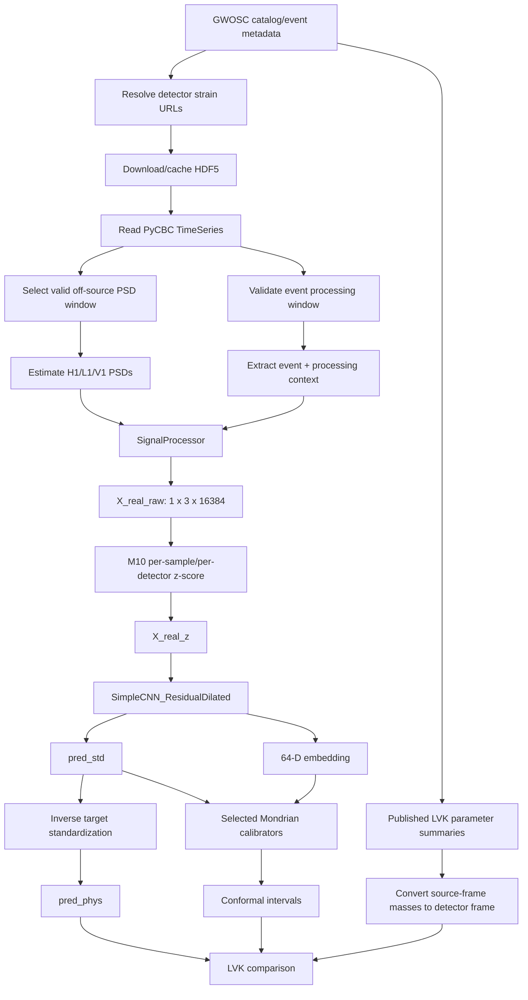

# Real-data inference and LVK comparison manual

> **Codebase manual — closed M10 reference**
>
> This document describes the real gravitational-wave inference layer of the `cbc_pe` repository as implemented in the closed M10 baseline.
>
> Reference snapshot:
>
> ```text
> tag:    m10-closed-baseline
> commit: dadf32f77f5c344c3519843e6bd9f0ee0c5baed0
> ```
>
> The goal is to explain how GWOSC strain is discovered, downloaded, validated, processed, normalized, passed through the CNN, calibrated with selected Mondrian conformal systems, converted to physical predictions, and compared against LVK reference values.

---

## 1. Scope

This document covers:

```text
src/real_data/
├── catalog.py
├── gwosc_utils.py
├── psd.py
├── signal_processing.py
├── inference.py
├── lvk_reference.py
└── event_runner.py

src/evaluation/
└── lvk.py
```

It also connects directly to the previously documented modules:

```text
docs/codebase_manual/modules/synthetic_generation.md
docs/codebase_manual/modules/cnn_pipeline.md
docs/codebase_manual/modules/conformal_pipeline.md
```

The principal closed-M10 notebooks using this stack are:

```text
12_real_event_inference_m10_500k_clean.ipynb
13_real_events_m10_500k_lvk_comparison_clean.ipynb
```

---

# 2. High-level responsibility map

The real-data stack is intentionally layered.

```text
GWOSC CATALOG / EVENT DISCOVERY
│
└── catalog.py
        │
        ▼
STRAIN FILE ACCESS / CACHE
│
└── gwosc_utils.py
        │
        ▼
PSD POLICY / ESTIMATION
│
└── psd.py
        │
        ▼
REAL STRAIN PREPROCESSING
│
└── signal_processing.py
        │
        ▼
REAL MODEL INPUT ORCHESTRATION
│
└── event_runner.py
        │
        ▼
CNN INFERENCE
│
└── inference.py
        │
        ▼
CONFORMAL APPLICATION
│
└── selected Mondrian calibrators
        │
        ▼
LVK REFERENCE CONSTRUCTION
│
└── lvk_reference.py
        │
        ▼
COMPARISON METRICS
│
└── evaluation/lvk.py
```

An important architectural property is:

```text
catalog access
≠
file I/O
≠
PSD estimation
≠
signal preprocessing
≠
model inference
≠
conformal calibration
≠
LVK comparison
```

This separation makes the pipeline easier to audit and modify prospectively.

---

# 3. Closed real-event workflow



---

# 4. Real-data input contract

Closed M10 expects detector order:

```text
H1
L1
V1
```

and final model-input shape:

```text
(1, 3, 16384)
```

for one event.

The final 4-second output window is centered around:

```text
center_time = gps_time + center_offset
```

while preprocessing is performed on a longer interval:

```text
processing window
=
final 4 s
+
left context
+
right context
```

The same `SignalProcessor` contract used in synthetic generation is reused on real detector strain.

---

# 5. `src/real_data/catalog.py`

## 5.1 Responsibility

This module handles GWOSC catalog metadata and strain-file URL discovery.

It does:

```text
query GWOSC API
handle pagination
flatten event metadata
flatten published parameters
filter by detector availability
resolve HDF5 URLs
```

It deliberately does **not**:

```text
download HDF5
read strain
estimate PSD
process strain
construct detector-frame LVK reference values
```

---

# 6. GWOSC API pagination

`fetch_paginated_json()` repeatedly requests:

```text
current URL
```

and follows the API-provided:

```text
next
```

field until no further page remains.

The original request parameters are not reused once GWOSC returns a pagination URL, because that URL already contains the necessary query state.

This prevents accidental duplication or inconsistent pagination behavior.

---

# 7. `fetch_gwosc_catalog_events()`

Queries:

```text
GWOSC API v2
/catalogs/<catalog>/events
```

and optionally requests:

```text
include-default-parameters = true
```

The returned event dictionaries feed:

```text
event discovery
detector filtering
LVK reference construction
```

---

# 8. `parameters_list_to_dict()`

GWOSC parameter entries are flattened into columns such as:

```text
<name>_best
<name>_lower_error
<name>_upper_error
<name>_lower
<name>_upper
<name>_unit
<name>_is_lower_limit
<name>_is_upper_limit
```

Absolute bounds are reconstructed as:

\[
\mathrm{lower}
=
\mathrm{best}
+
\mathrm{lower\_error}
\]

\[
\mathrm{upper}
=
\mathrm{best}
+
\mathrm{upper\_error}.
\]

The sign of `lower_error` therefore matters; it is not converted to an absolute magnitude first.

---

# 9. `gwosc_events_to_parameter_df()`

Produces one row per event.

Typical fields:

```text
event
shortName
catalog
gps_time
version
detectors

detail_url
parameters_url
timelines_url

flattened published parameters
```

This table becomes the common tabular event metadata representation.

---

# 10. Detector availability

`has_required_detectors()` parses flattened strings such as:

```text
"H1,L1,V1"
```

and verifies that all requested detectors are present.

Closed M10 model input requires a fixed detector network, so event eligibility depends on having the full required detector set.

---

# 11. HDF5 URL selection

`choose_best_4096s_hdf5_url()` applies the following preference:

1. HDF5 only;
2. 4096-second files only;
3. prefer R1 release when available;
4. deterministic sorted fallback.

The reason long 4096-second files are important is that one real-event analysis needs more than the event itself:

```text
event window
+
processing context
+
off-source PSD data
```

---

# 12. `build_gwosc_urls_for_events()`

For every event and listed detector:

```text
event
   ↓
detector
   ↓
resolve preferred 4096-s HDF5 URL
```

Only events with successfully resolved URLs for all required detectors are retained.

Failed event/detector pairs are recorded in a separate table.

This avoids silently running a 3-detector model on an incomplete network.

---

# 13. `src/real_data/gwosc_utils.py`

## 13.1 Responsibility

This module handles local cached GWOSC strain files.

Main functions:

```text
is_valid_hdf5()
download_if_needed()
read_gwosc_hdf5_as_pycbc_timeseries()
get_timeseries_bounds()
time_slice_is_finite()
```

---

# 14. HDF5 validation

`is_valid_hdf5()` checks:

```text
path exists
file opens with h5py
root keys can be read
```

This catches obviously truncated or malformed cache files before later analysis.

---

# 15. `download_if_needed()`

Workflow:

```text
requested GWOSC URL
    ↓
cache path
    ↓
existing file?
    ├── valid → reuse
    ├── invalid → delete
    └── absent → download
    ↓
validate downloaded HDF5
```

With `force=True`, an existing cache entry is removed and downloaded again.

This gives the real-data workflow deterministic cache semantics without repeatedly downloading large 4096-second files.

---

# 16. `read_gwosc_hdf5_as_pycbc_timeseries()`

Reads:

```text
strain/Strain
meta/GPSstart
meta/Duration
```

and derives:

\[
\Delta t
=
\frac{\mathrm{Duration}}
{N_\mathrm{samples}}.
\]

It returns:

```text
PyCBC TimeSeries
```

with:

```text
epoch = GPSstart
```

From this point onward, strain windows are selected in absolute GPS time.

---

# 17. TimeSeries validity checks

`time_slice_is_finite()` verifies:

```text
requested start >= available start
requested end <= available end
end > start
time_slice succeeds
non-empty result
all samples finite
```

This helper is reused when validating:

```text
event processing windows
PSD windows
```

and provides a common finite-data contract.

---

# 18. `src/real_data/psd.py`

## 18.1 Responsibility

This module defines:

```text
off-source PSD estimation
PSD-window availability checks
PSD-window selection policy
```

The key methodological difference from the synthetic pipeline is:

```text
synthetic:
    analytic design PSD

real:
    PSD estimated from off-source detector strain
```

---

# 19. `PSDWindowPolicy`

A dataclass for:

```text
preferred_window
candidate_windows
```

where every window is represented as:

```text
(start_offset, end_offset)
```

in seconds relative to event GPS time.

This lets the scientific PSD-window policy be supplied explicitly by the caller instead of being buried inside the estimator.

---

# 20. `estimate_offsource_psd()`

Inputs include:

```text
long detector strain
event time
PSD window offsets
target delta_f
sampling frequency
target frequency length
PSD segment duration
low-frequency cutoff
maximum whitening-filter duration
```

Workflow:

```text
long strain
    ↓
select off-source interval
    ↓
TimeSeries.psd(psd_segment_duration)
    ↓
interpolate to required delta_f
    ↓
inverse_spectrum_truncation
    ↓
crop to target frequency length
    ↓
validate finite PSD
```

---

# 21. Off-source PSD philosophy

The PSD window is separated from the event window.

Conceptually:

```text
OFF-SOURCE STRAIN
      ↓
 estimate PSD
      │
      └──────────────────────┐
                             ▼
EVENT STRAIN ─────────► whitening / filtering
```

This avoids estimating detector noise directly from a window containing the merger signal.

Typical closed-M10 settings include:

```text
PSD segment duration    = 8 s
low-frequency cutoff    = 30 Hz
max filter duration     = 0.5 s
```

---

# 22. `psd_window_is_available_and_finite()`

A PSD window is accepted only if it:

```text
exists
is time-ordered
is finite
is available
```

for **every detector**.

This means the network uses a common PSD-window policy across H1/L1/V1 rather than mixing arbitrary offsets per detector.

---

# 23. `select_valid_psd_window()`

Selection order:

```text
preferred window
        ↓
remaining candidate windows in supplied order
```

The first window valid for all detector strains is returned.

If none works:

```text
ValueError
```

This is important for multi-event robustness because different 4096-second GWOSC files may contain different invalid/gapped regions.

---

# 24. Closed-M10 PSD fallback fix

The closed runner uses:

```text
selected_psd_window
```

and explicitly unpacks:

```text
psd_start_offset
psd_end_offset
```

from the selected fallback before passing them into real processing.

Therefore the historical inconsistency:

```text
select fallback
but accidentally process with preferred offsets
```

is corrected in the closed baseline.

---

# 25. `src/real_data/signal_processing.py`

## 25.1 Responsibility

This module builds a real model input using the same **signal-processing contract** as synthetic training.

Main functions:

```text
event_window_is_available_and_finite()
build_real_input_like_training()
```

Importantly, it performs physical signal preprocessing but **not the model-specific M10 z-score**.

---

# 26. Event output window

For center:

\[
t_c
\]

and final duration:

\[
T
\]

the final output bounds are:

\[
t_\mathrm{out,start}
=
t_c-\frac{T}{2}
\]

\[
t_\mathrm{out,end}
=
t_c+\frac{T}{2}.
\]

For closed M10:

\[
T = 4\ \mathrm{s}.
\]

---

# 27. Processing-context window

The processing bounds are:

\[
t_\mathrm{proc,start}
=
t_\mathrm{out,start}
-
\frac{N_\mathrm{context,start}}{f_s}
\]

\[
t_\mathrm{proc,end}
=
t_\mathrm{out,end}
+
\frac{N_\mathrm{context,end}}{f_s}.
\]

Thus:

```text
context before | final 4 s | context after
|-----------------------------------------|
            process all
                 ↓
             crop 4 s
```

The complete context must be present and finite for every detector.

---

# 28. `event_window_is_available_and_finite()`

Checks the **complete processing window**, not only the final 4-second model interval.

Failure reasons include:

```text
processing window outside available data
processing window contains NaN/Inf
```

This is necessary because whitening and filtering depend on context samples outside the final CNN input.

---

# 29. Detector-order contract

`build_real_input_like_training()` explicitly requires:

```text
detectors == expected_detector_order
```

For closed M10:

```text
H1
L1
V1
```

The ordering is semantic.

This is not equivalent:

```text
H1, L1, V1
```

and:

```text
L1, H1, V1
```

even though the same physical detectors appear.

### Critical contract

```text
[CRITICAL DATA CONTRACT]

Real detector channel order must exactly match training channel order.
```

---

# 30. Real segment extraction

For each detector:

```text
raw 4096-s strain
    ↓
time_slice(processing_start, processing_end)
```

The code verifies:

```text
exact processing_length
finite values
```

before processing.

---

# 31. Real PSD construction

One PSD is estimated per detector using the selected common time-offset window.

The requested PSD spacing and length match the processing-segment frequency contract:

```text
processing_delta_f
processing_flength
```

This is required so the explicit PSD whitening path receives compatible time/frequency dimensions.

---

# 32. Reuse of `SignalProcessor`

After extracting:

```text
real_segments
psds
```

the function calls:

```text
processor.process_network(
    strains=real_segments,
    psds=psds,
)
```

The supplied processor is the same class documented for the synthetic pipeline.

Therefore the real workflow reuses the same operations:

```text
PSD whitening
high-pass filtering
low-pass filtering
processing-context crop
validation
```

according to the configured processor.

---

# 33. Final `X_real_raw`

Processed channels are stacked:

```text
H1
L1
V1
```

along channel axis and then a batch dimension is added.

For closed M10:

```text
X_real_raw.shape = (1,3,16384)
```

This array has already undergone physical preprocessing.

It has **not yet undergone the M10 model-specific input z-score**.

---

# 34. Physical preprocessing vs model normalization

This distinction is critical:

```text
SignalProcessor
    =
whitening / filters / crop

M10 input normalization
    =
per-sample/per-detector z-score
```

`build_real_input_like_training()` stops after the first stage.

`event_runner.py` applies the second stage.

This mirrors the separation in synthetic training:

```text
generated/processed HDF5
    ↓
model loader
    ↓
M10 z-score
```

---

# 35. Real context contains the physical GW when present

This is an important difference from the closed synthetic M10 generator.

Real processing begins from continuous recorded detector strain:

```text
noise + whatever physical GW is present
```

over the complete processing-context window.

Therefore if inspiral extends into the left processing context, those samples remain present during whitening/filtering.

Conceptually:

```text
REAL
context before       final 4 s       context after
|----------------|--------------------|----------------|
 noise + GW?          noise + GW          noise / GW?
```

depending on the physical signal.

This differs from closed synthetic M10 when the projected waveform was first truncated to at most 4 seconds.

---

# 36. Synthetic vs real context mismatch

Closed synthetic M10:

```text
full projected GW
    ↓
truncate/window to <= 4 s
    ↓
inject retained GW into longer noise context
```

Therefore:

```text
context outside retained 4 s
≈ noise only
```

even if the original physical waveform existed there.

Closed real M10:

```text
continuous detector strain
    ↓
extract 4 s + context directly
```

Therefore:

```text
context contains physical GW wherever it exists
```

### Audit note

```text
[SCIENTIFIC / PIPELINE REVIEW]

Real-data preprocessing preserves physical signal continuity across the
processing context, while closed synthetic M10 may not when the original
waveform exceeds the final analysis duration.

A future synthetic pipeline should preferably preserve GW support across
the processing context and crop only after preprocessing.
```

This is a forward-looking improvement, not a retroactive M10 bug fix.

---

# 37. `src/real_data/event_runner.py`

## 37.1 Responsibility

This is the main real-event orchestrator.

It does not implement the detailed mathematics of:

```text
PSD estimation
SignalProcessor
CNN forward pass
LVK transformation
```

but connects those reusable components.

---

# 38. `RealEventRunContext`

Stores runtime/model dependencies and shared processing parameters.

Examples:

```text
detector_order

GWOSC URLs
GWOSC cache dir

final duration / length
processing length

context sample counts

sampling frequency
processing delta_f
processing flength

PSD candidate windows

processor

input normalization epsilon

model
device

y_mean
y_std
label_names

apply_intervals callback
```

Conceptual distinction:

```text
event_cfg
    = which event?

RealEventRunContext
    = which pipeline/model should process it?
```

This is a good orchestration boundary.

---

# 39. `run_single_event()`

## 39.1 Event-specific inputs

Reads:

```text
event
gps_time
detectors

center_offset
psd_window
psd_segment_duration
```

and computes:

```text
center_time = gps_time + center_offset
```

---

# 40. Real-event execution sequence

```text
event config
    ↓
validate detector order
    ↓
resolve event detector URLs
    ↓
download/cache files
    ↓
read long detector strains
    ↓
validate full event processing window
    ↓
select valid common PSD window
    ↓
build_real_input_like_training()
    ↓
X_real_raw
    ↓
M10 input z-score
    ↓
predict_real_with_embeddings()
    ↓
pred_std / pred_phys / embedding
    ↓
apply selected Mondrian intervals
```

---

# 41. M10 real input normalization

The runner uses the exact batch-wise training implementation:

```text
normalize_batch_per_sample_per_detector_zscore()
```

on:

```text
X_real_raw
```

with the configured epsilon.

This is a strong implementation property:

```text
synthetic training normalization
and
real inference normalization
```

share the same function.

That reduces preprocessing drift.

---

# 42. `X_real_z`

After normalization:

```text
X_real_z.shape = (1,3,16384)
```

and each detector channel approximately has:

```text
temporal mean ≈ 0
temporal std  ≈ 1
```

independently.

This is the actual tensor-like input presented to the closed M10 CNN.

---

# 43. `src/real_data/inference.py`

## 43.1 Responsibility

Model inference only.

It assumes `X_real` is already fully preprocessed and normalized.

It does not:

```text
read GWOSC
estimate PSD
apply SignalProcessor
choose M10 normalization
fit Mondrian
```

---

# 44. `predict_real_with_embeddings()`

Inputs:

```text
model
X_real
device
y_mean
y_std
batch_size
```

Outputs:

```text
pred_std
pred_phys
embedding
```

Expected:

```text
X_real.shape = (N,C,T)
```

The model must support:

```text
return_embedding=True
```

---

# 45. Structural dummy targets

The reusable function:

```text
extract_predictions_and_embeddings()
```

expects DataLoader items shaped like:

```text
(X,y)
```

so real inference constructs:

```text
y_dummy = zeros
```

These dummy values are purely structural.

They are:

```text
not real-event truth
not used for evaluation
not used in conformal fitting
not used in interval construction
```

They exist only so a shared prediction helper can be reused.

---

# 46. Standardized and physical predictions

The CNN outputs:

```text
pred_std
```

in standardized target space.

`inverse_standardize()` applies:

\[
y_\mathrm{phys}
=
y_\mathrm{std}\sigma_\mathrm{train}
+
\mu_\mathrm{train}.
\]

Thus:

```text
chirp_mass → solar masses
total_mass → solar masses
chi_eff    → dimensionless
```

---

# 47. Real-event embedding

The same forward pass returns:

```text
emb_real
```

For closed M10:

```text
embedding dimension = 64
```

This is required whenever a selected Mondrian calibrator uses:

```text
taxonomy_mode = difficulty
```

Thus the real-event CNN output contract is:

```text
point prediction
+
latent embedding
```

not only a scalar parameter vector.

---

# 48. Conformal application in `event_runner`

The runner delegates interval construction via:

```text
context.apply_intervals(...)
```

passing:

```text
event name
selected final policy
pred_real_std
emb_real
pred_real_phys
```

The conformal system was already fitted from synthetic calibration data.

No real-event truth enters this operation.

---

# 49. `run_single_event()` return object

Returns a rich debugging dictionary including:

```text
event
config
selected_psd_window
metadata

raw_strains_long
processed
psds
real_segments

X_real_raw
X_real_z

pred_real_std
pred_real_phys
emb_real

point_df
interval_df
```

This is useful for one-event inspection and debugging.

For multi-event studies, retaining all raw 4096-second strains per event is memory-expensive, so notebook-level streaming/lightweight aggregation is preferable.

---

# 50. `events_df_to_event_configs()`

Converts an event table into executable configuration dictionaries.

An event is skipped if:

```text
event missing from GWOSC URL dictionary
or
one or more required detector URLs are unavailable
```

Returned configs contain only fields used by the current runner:

```text
event
gps_time
detectors
psd_window
center_offset
psd_segment_duration
```

This keeps run configuration explicit and small.

---

# 51. `classify_failure_reason()`

Maps known runtime failures to stable labels such as:

```text
nonfinite_event_window
no_valid_psd_window
nonfinite_psd
window_outside_available_data
corrupted_or_truncated_hdf5
missing_url
invalid_hdf5_download
other
```

This is especially useful in multi-event runs because analysis tables can reason about stable failure categories rather than raw exception strings.

---

# 52. `src/real_data/lvk_reference.py`

## 52.1 Responsibility

Convert published GWOSC/LVK parameter summaries into reference quantities compatible with the model output.

The model predicts detector-frame masses.

Published GWOSC summaries include source-frame mass quantities.

Therefore masses must be transformed before comparison.

---

# 53. Source-frame to detector-frame mass conversion

For redshift \(z\):

\[
M_\mathrm{det}
=
(1+z)M_\mathrm{source}.
\]

This transformation applies to:

```text
chirp mass
total mass
component masses
```

when corresponding source-frame summaries are available.

Dimensionless:

```text
chi_eff
```

is copied without redshift conversion.

---

# 54. `propagate_detector_frame_mass_interval()`

The function performs first-order asymmetric propagation.

Central value:

\[
M_\mathrm{det}
=
(1+z)M.
\]

Define:

\[
\Delta M_- = M-M_\mathrm{lower}
\]

\[
\Delta M_+ = M_\mathrm{upper}-M
\]

and:

\[
\Delta z_- = z-z_\mathrm{lower}
\]

\[
\Delta z_+ = z_\mathrm{upper}-z.
\]

Then:

\[
\Delta M_{\mathrm{det},-}
=
\sqrt{
[(1+z)\Delta M_-]^2
+
[M\Delta z_-]^2
}
\]

and:

\[
\Delta M_{\mathrm{det},+}
=
\sqrt{
[(1+z)\Delta M_+]^2
+
[M\Delta z_+]^2
}.
\]

Bounds:

\[
M_{\mathrm{det,lower}}
=
M_\mathrm{det}
-
\Delta M_{\mathrm{det},-}
\]

\[
M_{\mathrm{det,upper}}
=
M_\mathrm{det}
+
\Delta M_{\mathrm{det},+}.
\]

---

# 55. Interpretation of LVK uncertainty propagation

This is a **first-order summary-level propagation**.

It is not equivalent to:

```text
loading posterior samples
transforming every sample to detector frame
recomputing posterior credible intervals
```

Therefore the resulting detector-frame interval is an approximation based on published central/lower/upper summaries and redshift uncertainty.

### Reference-model note

```text
[REFERENCE-MODEL NOTE]

Detector-frame LVK reference intervals are reconstructed by
first-order uncertainty propagation from published summaries,
not by posterior-sample transformation.
```

---

# 56. `build_lvk_reference_detector_frame()`

Required base information includes:

```text
event
gps_time
catalog
detectors

redshift best/lower/upper

chirp_mass_source best/lower/upper

chi_eff best/lower/upper
```

The output includes:

```text
chirp_mass_lvk
chirp_mass_lvk_lower
chirp_mass_lvk_upper

total_mass_lvk
total_mass_lvk_lower
total_mass_lvk_upper

chi_eff_lvk
chi_eff_lvk_lower
chi_eff_lvk_upper
```

and component-mass detector-frame fields when available.

---

# 57. Total mass fallback

If published:

```text
total_mass_source
```

columns exist, they are used.

Otherwise total source-frame mass is reconstructed:

\[
M_\mathrm{tot}
=
m_1+m_2.
\]

The resulting total mass is then propagated to detector frame.

---

# 58. `chi_eff`

No redshift correction is applied:

```text
chi_eff_lvk
=
published chi_eff
```

because `chi_eff` is dimensionless.

---

# 59. `src/evaluation/lvk.py`

## 59.1 Responsibility

Numerical/tabular comparison between:

```text
CNN point predictions
CNN conformal intervals
LVK reference values
```

It does not perform plotting or raw-strain processing.

Main functions:

```text
add_physical_clipped_intervals()
cnn_results_to_wide()
add_lvk_comparison_metrics()
```

---

# 60. `add_physical_clipped_intervals()`

Adds:

```text
lower_phys_clipped
upper_phys_clipped
```

For mass targets only:

\[
L_\mathrm{clipped}
=
\max(0,L).
\]

`chi_eff` is not clipped.

The original conformal columns remain unchanged.

### Visualization contract

```text
[VISUALIZATION CONTRACT]

Clipped mass intervals are for physically sensible visualization only.

Do not silently use clipped intervals for:
    coverage
    scientific width
    interval overlap
    membership calculations
```

---

# 61. `cnn_results_to_wide()`

Converts long-format:

```text
point_df
interval_df
```

into one row per event.

For each label:

```text
<label>_cnn
<label>_cnn_lower
<label>_cnn_upper
```

This is the structure required to join model output with the wide LVK reference table.

The function can optionally use clipped bounds, but closed scientific comparisons should use original conformal intervals unless visualization-specific behavior is explicitly requested.

---

# 62. `add_lvk_comparison_metrics()`

For every label, requires:

```text
CNN point
CNN lower
CNN upper

LVK central
LVK lower
LVK upper
```

and computes multiple diagnostics.

---

# 63. CNN minus LVK point difference

Definition:

\[
\Delta
=
\hat y_\mathrm{CNN}
-
y_\mathrm{LVK}.
\]

Interpretation:

```text
positive Δ
    CNN point above LVK central value

negative Δ
    CNN point below LVK central value
```

---

# 64. Normalized LVK difference

Definition:

\[
\Delta_\mathrm{norm}
=
\frac{
\hat y_\mathrm{CNN}
-
y_\mathrm{LVK}
}{
\frac12
(
U_\mathrm{LVK}
-
L_\mathrm{LVK}
)
}.
\]

This normalizes point disagreement by an average LVK half-width.

### Limitation

For an asymmetric LVK interval, this does not distinguish:

```text
distance toward upper tail
distance toward lower tail
```

because it uses the same denominator:

\[
(U-L)/2
\]

on both sides.

Therefore:

```text
[METRIC LIMITATION]

normalized_delta_lvk is a convenient scale-normalized diagnostic,
not a rigorous posterior-distance statistic for asymmetric LVK intervals.
```

---

# 65. Point/interval membership checks

Two separate booleans are computed.

### CNN point inside LVK interval

```text
LVK lower
    <=
CNN point
    <=
LVK upper
```

### LVK central value inside CNN interval

```text
CNN lower
    <=
LVK central
    <=
CNN upper
```

These are not equivalent.

A wide LVK interval can contain the CNN point even when a narrower CNN interval does not contain the LVK central estimate.

---

# 66. Absolute interval overlap

For CNN interval:

\[
[L_C,U_C]
\]

and LVK interval:

\[
[L_L,U_L]
\]

the overlap length is:

\[
O
=
\max
\left(
0,
\min(U_C,U_L)
-
\max(L_C,L_L)
\right).
\]

---

# 67. LVK-normalized overlap fraction

Definition:

\[
f_\mathrm{overlap,LVK}
=
\frac{
O
}{
U_L-L_L
}.
\]

This is **not intersection-over-union (IoU)**.

Example:

```text
CNN = [0,100]
LVK = [40,60]
```

Then:

```text
overlap = 20
LVK width = 20
fraction = 1
```

even though the CNN interval is much broader.

Interpretation:

```text
fraction = 1
```

means the CNN interval covers the full LVK interval.

It does **not** mean both intervals have matching widths or boundaries.

---

# 68. Synthetic vs real processing contract

This section summarizes where synthetic and real M10 pipelines are equivalent and where they differ.

## Equivalent components

```text
sampling frequency
final model duration
final detector ordering
SignalProcessor implementation
whitening mode/configuration
HP/LP processing behavior
final crop shape
M10 input z-score implementation
CNN checkpoint
label inverse-standardization
Mondrian fitted calibrators
```

## Different components

```text
noise source

synthetic:
    Gaussian colored noise from analytic design PSD

real:
    actual detector strain


PSD source

synthetic:
    analytic design PSD

real:
    off-source empirical PSD


signal support in processing context

synthetic M10:
    projected GW truncated to <= final 4 s before context injection

real:
    continuous detector strain may contain GW throughout context


noise stationarity

synthetic:
    stationary Gaussian construction by design

real:
    may contain nonstationarity / glitches / transient structure
```

---

# 69. Domain-gap interpretation

The closed real-data pipeline attempts to hold constant:

```text
processing
input shape
detector order
input z-score
CNN architecture
target scaling
conformal system
```

while changing the data domain from:

```text
synthetic Gaussian noise
```

to:

```text
real detector strain
```

Therefore discrepancies between synthetic-test behavior and real-event behavior may arise from:

```text
PSD mismatch
nonstationarity
glitches/transients
different higher-order noise statistics
signal-generation mismatch
waveform-systematics
different signal-support behavior in processing context
selection effects
```

The current real-data code is structured well enough that future work can isolate several of these sources independently.

---

# 70. PSD stationarity assumption

When one off-source PSD is used to whiten the event segment, the pipeline assumes that this PSD is sufficiently representative of the detector-noise spectrum around the event.

### Scientific assumption

```text
[SCIENTIFIC ASSUMPTION]

The selected off-source PSD is treated as an adequate local noise-spectrum
model for processing the event window.
```

Real detector noise is not guaranteed to be stationary between the PSD window and event time.

This is one important potential source of domain mismatch.

---

# 71. Active-code classification

## Active real-data core

```text
src/real_data/catalog.py
src/real_data/gwosc_utils.py
src/real_data/psd.py
src/real_data/signal_processing.py
src/real_data/inference.py
src/real_data/event_runner.py
src/real_data/lvk_reference.py
src/evaluation/lvk.py
```

These form the closed M10 real-event path.

---

# 72. Important audit findings

## `[CRITICAL DATA CONTRACT]` detector order

Real channel order must match training exactly.

---

## `[CRITICAL PROCESSING CONTRACT]` preprocessing split

`build_real_input_like_training()` applies physical signal processing but not the M10 z-score.

The z-score is applied later by `event_runner.py`.

---

## `[SCIENTIFIC / PIPELINE REVIEW]` synthetic context mismatch

Real processing preserves continuous physical signal in the processing context.

Synthetic M10 may remove waveform support outside the final 4-second retained signal.

Future synthetic pipelines should consider preserving GW support across processing context.

---

## `[SCIENTIFIC ASSUMPTION]` off-source PSD representativeness

PSD estimated far from the event is assumed sufficiently representative for event whitening.

---

## `[REFERENCE-MODEL NOTE]` detector-frame LVK approximation

LVK intervals are transformed using first-order propagation from summary statistics, not posterior samples.

---

## `[METRIC LIMITATION]` normalized LVK delta

Uses average half-width even for asymmetric LVK intervals.

---

## `[METRIC INTERPRETATION]` overlap fraction

LVK-normalized overlap fraction is not IoU.

---

## `[VISUALIZATION CONTRACT]` interval clipping

Mass clipping at zero is visualization-only.

---

## `[INFRASTRUCTURE NOTE]` dummy real targets

Dummy targets used during real inference are structural DataLoader placeholders only.

They are not scientific truth values.

---

# 73. Change-impact guide

## If changing detector order

Affected:

```text
synthetic dataset generation
CNN training
real processing
real event runner
checkpoint compatibility
all real-event predictions
```

This is a breaking model-input contract.

---

## If changing event-window duration or placement

Review:

```text
SimulationConfig
SignalProcessor context
signal_processing.py
event_runner.py
CNN expected input length
checkpoint architecture assumptions
```

A different temporal input generally requires a new model.

---

## If changing processing context

Review:

```text
synthetic generation
real-data extraction
SignalProcessor crop behavior
processing_length
processing_delta_f
processing_flength
PSD construction
```

Context changes can alter whitening/filter edge behavior.

---

## If changing PSD strategy

Primary files:

```text
src/real_data/psd.py
src/real_data/event_runner.py
src/real_data/signal_processing.py
```

Also re-evaluate:

```text
real input scale/morphology
CNN predictions
event sensitivity
domain gap
```

---

## If changing PSD window policy

Review:

```text
preferred window
candidate windows
event-specific overrides
multi-event failure rates
PSD variability diagnostics
```

This changes the empirical noise model used for whitening and therefore can change CNN predictions.

---

## If changing M10 input normalization

Review:

```text
src/models/dataset.py
src/models/hdf5_batch_dataset.py
src/real_data/event_runner.py
training checkpoint compatibility
real inference
```

Real and synthetic implementations must remain identical.

---

## If changing real-data inference helper

Verify:

```text
pred_std
pred_phys
embedding
sample ordering
label ordering
```

and ensure `return_embedding=True` remains compatible with conformal difficulty.

---

## If changing LVK detector-frame conversion

Review:

```text
src/real_data/lvk_reference.py
evaluation tables
reported real-event disagreement
physical interpretation
```

Any move from first-order propagation to posterior-sample transformation should be documented as a methodological change.

---

## If changing comparison metrics

Review:

```text
src/evaluation/lvk.py
notebook 13
report tables
figures
metric interpretation text
```

Do not silently redefine:

```text
normalized_delta_lvk
interval_overlap_fraction_lvk
```

because historical M10 comparisons depend on their current definitions.

---

# 74. Closed M10 real-data workflow summary

```text
GWOSC event/catalog
        │
        ▼
resolve 4096-s HDF5 URLs
        │
        ▼
download/cache + validate
        │
        ▼
PyCBC long detector strains
        │
        ├──────────────► select off-source PSD window
        │                         │
        │                         ▼
        │                    estimate PSDs
        │
        ▼
validate/extract event processing window
        │
        ▼
SignalProcessor
        │
        ▼
crop final 4 s
        │
        ▼
X_real_raw
(1,3,16384)
        │
        ▼
per-sample/per-detector M10 z-score
        │
        ▼
X_real_z
        │
        ▼
SimpleCNN_ResidualDilated
        │
        ├── pred_std
        └── 64-D embedding
        │
        ▼
inverse target standardization
        │
        ▼
pred_phys
        │
        ├─────────────────────┐
        │                     │
        ▼                     ▼
selected Mondrian       GWOSC/LVK summaries
        │                     │
        ▼                     ▼
CNN intervals        source→detector frame
        │                     │
        └──────────┬──────────┘
                   ▼
           LVK comparison metrics
```

---

# 75. Mental model to retain

```text
catalog.py
    = what events exist and where are their strain files?

gwosc_utils.py
    = download, validate and read those files

psd.py
    = which off-source data define the empirical detector PSD?

signal_processing.py
    = convert real strain + PSD into the same processed 4-s shape as training

event_runner.py
    = orchestrate one real event end to end

inference.py
    = run the CNN and recover physical predictions + embeddings

lvk_reference.py
    = transform published LVK summaries into detector-frame references

evaluation/lvk.py
    = compare CNN points/intervals against those references
```

The shortest accurate description of the closed real-data stack is:

```text
closed M10 real inference
=
GWOSC continuous detector strain
+
off-source empirical PSD
+
training-compatible SignalProcessor
+
same M10 per-detector input z-score
+
same residual-dilated CNN checkpoint
+
same selected synthetic Mondrian calibrators
+
detector-frame LVK comparison
```

---

# 76. Status of this manual section

This document describes the **closed M10 real-data behavior**.

Known limitations and future improvements are intentionally documented separately from active baseline behavior.

In particular, future work may improve:

```text
synthetic processing-context physical continuity
real-noise modeling
PSD robustness
nonstationarity handling
glitch/transient treatment
LVK reference construction
domain-gap diagnostics
```

without rewriting the historical M10 definition.
