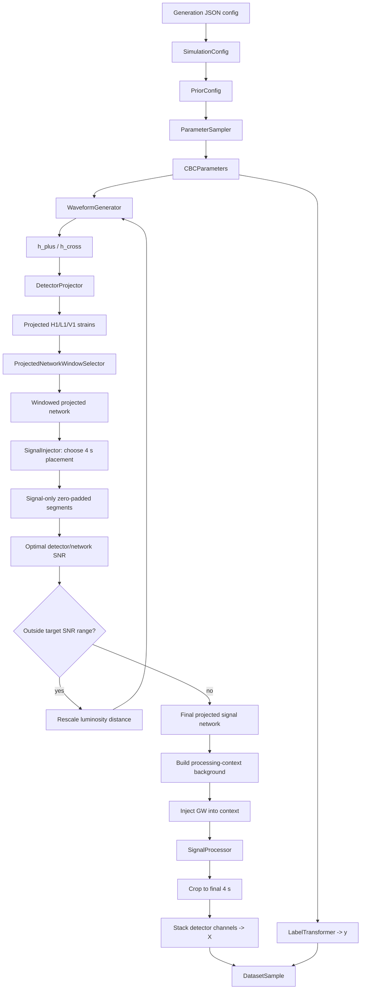

# Synthetic generation pipeline

## Scope and reference snapshot

This document describes the active synthetic-data generation core of `cbc_pe` as frozen in the closed M10 baseline.

Reference:

- Git tag: `m10-closed-baseline`
- Commit: `dadf32f77f5c344c3519843e6bd9f0ee0c5baed0`
- Main namespace: `cbc_pe/src/`
- Primary orchestration class: `src.dataset.DatasetBuilder`

The purpose of this document is not to justify the scientific choices of M10, but to explain exactly where those choices are implemented, how data move through the code, and what assumptions or invariants each module imposes.

The active modules covered here are:

```text
src/config.py
src/parameters.py
src/sampling.py
src/waveform.py
src/detectors.py
src/windowing.py
src/injection.py
src/noise.py
src/snr.py
src/processing.py
src/labels.py
src/dataset.py
```

---

# 1. High-level architecture

The synthetic pipeline is deliberately split into small components with distinct responsibilities.



A useful conceptual division is:

1. **Physical source definition**: `parameters.py`, `sampling.py`.
2. **Signal generation and detector response**: `waveform.py`, `detectors.py`.
3. **Temporal support and placement**: `windowing.py`, `injection.py`.
4. **Noise and SNR control**: `noise.py`, `snr.py`.
5. **Signal conditioning**: `processing.py`.
6. **Targets**: `labels.py`.
7. **End-to-end orchestration and provenance**: `dataset.py`.

---

# 2. Core data contracts

## 2.1 Physical parameters

A physical binary is represented by `CBCParameters`:

```text
mass_1
mass_2
distance
inclination
ra
dec
spin_1z
spin_2z
polarization_angle
```

Important invariant:

```text
mass_1 >= mass_2
```

If the object is constructed with `mass_1 < mass_2`, the two masses are exchanged and the associated z-spin components are exchanged with them.

Derived quantities are:

```text
total_mass = mass_1 + mass_2
chirp_mass = (m1*m2)^(3/5) / (m1+m2)^(1/5)
chi_eff = (m1*spin_1z + m2*spin_2z) / (m1+m2)
```

## 2.2 Detector-network input

For the closed M10 dataset, the final model input is conceptually:

```text
X.shape = (n_detectors, n_samples)
```

with the standard detector order:

```text
[H1, L1, V1]
```

For 4 s at 4096 Hz:

```text
n_samples = 4 * 4096 = 16384
X.shape = (3, 16384)
```

The dataset-level shape is therefore:

```text
(N, 3, 16384)
```

## 2.3 Regression labels

`LabelTransformer` defines the fixed label order:

```text
y[0] -> chirp_mass
y[1] -> total_mass
y[2] -> chi_eff
```

This ordering is a critical contract shared by training, prediction, evaluation and conformal calibration.

---

# 3. `src/config.py`

## Responsibility

Defines `SimulationConfig`, the central in-memory configuration object for the numerical and physical assumptions shared by the synthetic pipeline.

It does not generate signals itself. Instead, it provides common values and validates invariants used by waveform generation, detector projection, noise generation, injection, SNR calculation, processing and dataset construction.

## Main class: `SimulationConfig`

`SimulationConfig` is a frozen dataclass. Important fields include:

```text
simulation_regime
waveform_family
sampling_frequency
duration
low_frequency_cutoff
waveform_approximant
target_network_snr_range
snr_relative_tolerance
snr_on_truncated_signal
truncation_policy
required_final_duration
event_time_reference
safe_margin_start
safe_margin_end
processing_context_start_samples
processing_context_end_samples
```

### Derived numerical properties

The class exposes values repeatedly needed elsewhere:

```text
delta_t = 1 / sampling_frequency
length = duration * sampling_frequency
delta_f = 1 / duration
flength = length // 2 + 1
```

For processing-context data it separately defines:

```text
processing_length
processing_duration
processing_delta_f
processing_flength
```

This distinction matters because whitening of a longer context segment requires a PSD with the frequency resolution corresponding to that longer segment.

### Validation performed in `__post_init__`

Among other checks, the class verifies:

- positive sampling frequency and duration;
- positive low-frequency cutoff;
- ordered and positive SNR target range;
- valid safe margins;
- integer number of samples in the requested duration;
- consistency between simulation regime and waveform family;
- non-negative processing-context lengths;
- current support for `snr_on_truncated_signal=True` only.

## Change-impact notes

Changing this module can affect essentially the whole synthetic pipeline. In particular:

- `sampling_frequency` changes all array lengths and FFT resolutions;
- `duration` changes the model input support and SNR window;
- processing-context fields change whitening/filtering support;
- the waveform approximant changes the generated physical signal;
- SNR targeting fields alter the effective distance distribution.

Treat modifications here as **high scientific/reproducibility risk**.

---

# 4. `src/parameters.py`

## Responsibility

Defines the physical state of one compact-binary realization independently of how it was sampled or how its waveform is generated.

## Main class: `CBCParameters`

A frozen dataclass containing masses, distance, source orientation, sky position and aligned-spin components.

### `__post_init__`

Performs normalization and validation.

Important behavior:

1. If `mass_1 < mass_2`, masses are swapped.
2. `spin_1z` and `spin_2z` are swapped together with their associated masses.
3. RA and polarization are reduced modulo `2*pi`.
4. Physical ranges are validated.

### Derived properties

- `total_mass`
- `chirp_mass`
- `chi_eff`

### `with_distance(distance)`

Returns a new `CBCParameters` object with all physical parameters unchanged except luminosity distance.

This method is a critical part of SNR targeting because the pipeline can change the amplitude scale through distance while preserving masses, spins, orientation and sky position.

## Scientific assumption

Only the aligned z-components of the component spins are represented:

```text
spin_1z
spin_2z
```

There are no in-plane spin degrees of freedom in `CBCParameters`.

---

# 5. `src/sampling.py`

## Responsibility

Defines priors and draws physical CBC parameter realizations.

## `PriorConfig`

A frozen dataclass describing the sampling ranges and optional fixed parameters.

It supports regime-specific constructors:

```text
PriorConfig.bbh()
PriorConfig.bns()
```

The BBH defaults use component masses, distance and z-spin ranges appropriate to the current BBH pipeline.

### `fixed_parameters`

A dictionary may override any sampled parameter. This is what allows the same generator to support fixed-mass or signal-only campaigns without creating a separate parameter-generation implementation.

### `from_dict()`

Converts the configuration dictionary supplied by generation JSON files into a validated `PriorConfig`.

## `ParameterSampler`

Consumes `PriorConfig` and an optional NumPy random generator.

### `sample_one()`

Samples:

- component masses uniformly over the configured range;
- distance uniformly over the configured range;
- z-spins uniformly over configured ranges;
- RA uniformly in `[0, 2*pi]`;
- polarization uniformly in `[0, 2*pi]`;
- inclination isotropically through `cos(iota) ~ Uniform(-1,1)`;
- declination isotropically through `sin(dec) ~ Uniform(-1,1)`.

Configured fixed values overwrite random draws at the end.

The returned object is always a validated `CBCParameters` instance.

### `sample_many(n_samples)`

Repeatedly calls `sample_one()` and returns a list of parameter objects.

## Scientific note

The prior is the **proposal distribution**, not necessarily the exact final distribution of accepted samples. `DatasetBuilder` may reject invalid realizations, and SNR targeting can later modify luminosity distance. Therefore the effective generated-data distribution should be audited from saved metadata rather than inferred only from `PriorConfig`.

---

# 6. `src/waveform.py`

## Responsibility

Generates the source-frame plus and cross gravitational-wave polarizations.

It has no detector-specific responsibility.

## Data classes

### `WaveformMetadata`

Stores:

```text
approximant
low_frequency_cutoff
delta_t
n_samples
duration
start_time
end_time
```

### `GeneratedWaveform`

Contains:

```text
h_plus
h_cross
metadata
```

## `WaveformGenerator`

### `generate(parameters)`

Calls PyCBC `get_td_waveform()` with:

```text
mass1
mass2
distance
inclination
spin1z
spin2z
f_lower
delta_t
approximant
```

The result is validated and wrapped in `GeneratedWaveform`.

### `_validate_waveform_pair()`

Requires `h_plus` and `h_cross` to have matching:

- length;
- `delta_t`;
- start time;
- configured sampling interval.

## Boundary of responsibility

```text
waveform.py -> physical h_plus/h_cross only
```

Sky location, antenna response and detector delays belong to `detectors.py`.

---

# 7. `src/detectors.py`

## Responsibility

Projects the generated plus/cross polarizations into detector strain for a network such as H1/L1/V1.

## Data classes

### `ProjectionMetadata`

Tracks:

```text
detector_names
geocentric_coalescence_time
expected_detector_time_delays
detector_arrival_times
projected_start_times
projected_end_times
```

### `ProjectedStrains`

Contains:

```text
strains: dict[detector, TimeSeries]
metadata: ProjectionMetadata
```

## `DetectorProjector`

### Constructor

Builds PyCBC `Detector` objects. Default detector network:

```text
H1
L1
V1
```

### `project()`

The incoming waveform uses a relative time axis where the reference/coalescence is associated with `t=0`.

`project()` first shifts the waveform epoch onto an absolute geocentric reference time. It then calls PyCBC/LAL detector projection using:

```text
ra
dec
polarization_angle
```

The projection applies both antenna response and detector-dependent physical time delay.

### `compute_time_delays()`

Explicitly computes detector delays relative to the Earth center for metadata/validation.

Important distinction:

> `compute_time_delays()` does not itself shift the projected waveforms. The actual time shifting is performed by `Detector.project_wave(..., method="lal")` inside `project()`.

---

# 8. `src/windowing.py`

## Responsibility

Selects which part of the already-projected detector network is retained when the physical waveform network is longer than the configured analysis duration.

This operation occurs **after detector projection** so that a common absolute-time window can be defined while respecting detector delays.

It does not add noise, perform SNR calculation or run preprocessing.

## Data classes

### `NetworkWindowMetadata`

Records both full and retained network support, including:

```text
is_truncated
truncation_policy
full_network_start/end/duration
used_window_start/end/duration
required_final_duration
fraction_network_duration_used
full and used start/end times per detector
full and used sample counts per detector
```

### `WindowedProjectedNetwork`

Contains the retained projected detector strains plus `NetworkWindowMetadata`.

The retained detector strains are not padded here.

## `ProjectedNetworkWindowSelector`

### `select(projected_strains, max_duration=None)`

The active `DatasetBuilder` calls this with:

```text
max_duration = config.duration
```

Thus, in M10, the signal network is retained over at most the final **4 s analysis duration**, not `4 s + processing context`.

### Truncation behavior

- `truncation_policy="none"`: reject a projected network longer than the maximum duration.
- `keep_full_if_possible` or `keep_last_segment`: if the network fits, keep it; otherwise retain the last `max_duration` seconds.

For a long waveform:

```text
full projected network
|---------------------------------------------------------|

                              retained last <= 4 s
                              |----------------------------|
```

### `_network_time_bounds()`

Defines network support by:

```text
network_start = minimum detector start time
network_end   = maximum detector end time
```

### `_slice_timeseries_by_time()`

Slices each detector by overlap with the common absolute-time network window.

## M10-specific processing-context limitation

This is an important closed-baseline behavior.

The signal is first truncated/windowed to at most the 4 s analysis window. Only afterwards is a longer processing-context segment constructed. Therefore, when the original physical waveform extends before the retained 4 s interval, that discarded inspiral does **not** reappear in the processing context.

Conceptually, M10 processes:

```text
context before        final 4 s         context after
|---- noise ----|--- noise + GW ---|---- noise ----|
```

rather than preserving all physically available GW support:

```text
context before        final 4 s         context after
|-- noise + GW --|--- noise + GW ---|---- noise ----|
```

The current context still serves its primary M10 purpose: moving whitening/FIR edge corruption away from the final model input. However, it does not guarantee physical continuity of a long GW outside the selected 4 s signal window.

### Future-pipeline improvement

For a future pipeline (e.g. M11 or later), consider separating:

```text
physical waveform support
processing support
analysis window
SNR window
```

A cleaner design would preserve the full available projected GW across the processing window, perform injection and preprocessing over `analysis window + context`, and crop to the final 4 s only after processing. The target SNR could still remain defined on the final analysis window.

This is a future improvement and must not be retroactively applied to the closed M10 baseline.

---

# 9. `src/injection.py`

## Responsibility

Handles placement and additive injection on a common absolute time axis.

Two concepts are intentionally separated:

```text
placement -> choose where the fixed output segment lies
injection -> add the signal samples that overlap that segment
```

## Data classes

### `SegmentPlacement`

Stores:

```text
segment_start/end_time
earliest_signal_start_time
latest_signal_end_time
valid_start_min/max
placement_policy
signal_network_duration
safe margins
actual before/after margins
margins_respected
```

### `InjectionResult`

Stores both the output strain and exact overlap bookkeeping:

```text
signal_start/end_time
segment_start/end_time
signal_start/end_index
overlap indices in strain
overlap indices in signal
n_signal_samples
n_injected_samples
n_clipped_before/after
is_partially_clipped
```

## `choose_segment_placement_containing_network()`

Computes a valid fixed-duration segment that contains the complete retained detector network.

It first obtains:

```text
earliest signal start across detectors
latest signal end across detectors
```

and derives the valid interval of possible segment start times while respecting requested margins.

Supported policies:

```text
end_aligned
start_aligned
centered
random_contained
```

The default used by `DatasetBuilder.build_sample()` is `random_contained`.

This means the GW is not forced to appear at one fixed time index inside every 4 s input.

## `inject(strain, signal)`

Requires strain and signal to already share the same absolute time coordinate system and `delta_t`.

The method converts their time offset into sample indices, computes overlap, copies the input strain, and adds the overlapping signal samples.

Important distinction:

> `inject()` does not compute detector delays. Those delays are already encoded in detector-specific projected `TimeSeries` objects by `DetectorProjector`.

## `inject_network()`

Applies `inject()` detector by detector and requires matching detector sets.

## `build_zero_strain()`

Creates a zero-valued `TimeSeries` of either final analysis length or explicitly requested processing length.

It is used in two important places:

1. signal-only embedding for optimal-SNR calculation;
2. `strain_mode="gw_only"`, where zero background replaces noise while the rest of the pipeline remains unchanged.

## `set_strain_start_time()`

Copies a strain and sets its absolute epoch. This is used to align generated noise with the final processing-context time window.

---

# 10. `src/noise.py`

## Responsibility

Provides synthetic detector-noise PSDs and Gaussian noise realizations.

## `NoiseModel`

The closed M10 model maps detectors to analytical PyCBC PSDs:

```text
H1 -> aLIGOZeroDetHighPower
L1 -> aLIGOZeroDetHighPower
V1 -> AdvVirgo
```

Therefore the synthetic M10 training noise is **Gaussian colored noise generated from analytical PSD models**, not real detector noise.

### `_build_psd()`

Builds the analytical detector PSD for a requested FFT length and `delta_f`.

### `get_psd(detector, length=None)`

Computes the correct PSD shape and frequency resolution for the requested temporal support:

```text
flength = length // 2 + 1
duration = length * delta_t
delta_f = 1 / duration
```

PSDs are cached by detector, length and frequency spacing.

This permits separate PSDs for:

```text
final 4 s SNR calculation
longer processing-context whitening
```

### `sample()`

Calls PyCBC `noise_from_psd()` to generate a Gaussian colored-noise `TimeSeries`.

### `sample_network()`

Uses one global seed to generate independent detector-specific seeds, avoiding identical random noise realizations across H1/L1/V1.

### `metadata()`

Records PSD model names and both analysis-window and processing-window FFT geometry.

---

# 11. `src/snr.py`

## Responsibility

Computes detector/network optimal SNR and controls luminosity-distance rescaling to the configured target SNR interval.

## `compute_detector_optimal_snr()`

Requires a signal-only fixed-length detector segment and a compatible PSD.

The signal is transformed to frequency domain and PyCBC `sigma()` computes optimal matched-filter SNR with the configured low-frequency cutoff.

The SNR is therefore calculated from the **signal**, weighted by the detector PSD. It is not estimated from one random `noise + signal` realization.

## `compute_network_snr()`

Combines detector SNR values as:

```text
rho_network = sqrt(sum(rho_detector^2))
```

## `compute_network_optimal_snr()`

Computes every detector optimal SNR and then the network norm.

## `rescale_distance_for_target_network_snr()`

Uses the amplitude/SNR scaling with luminosity distance:

```text
new_distance = old_distance * current_snr / target_snr
```

## `decide_distance_rescaling()`

Behavior:

- if no target range exists, do not rescale;
- if current SNR already lies inside the range, do not rescale;
- otherwise draw a target SNR uniformly from the configured range and derive a new distance.

## `validate_snr_rescaling()`

After the signal network is regenerated at the new distance, verifies that the achieved network SNR matches the requested target within the configured relative tolerance.

## Scientific implication

The final luminosity-distance distribution is not simply the raw distance prior. SNR targeting transforms distances for samples outside the desired SNR range.

---

# 12. `src/processing.py`

## Responsibility

Transforms injected detector strain over the processing-context window into the final fixed-duration model input.

This is one of the highest-impact modules in the pipeline because it controls whitening, filtering, optional standardization, edge handling and final cropping.

## `SignalProcessor`

Important configuration fields include:

```text
whitening_method
apply_lowpass
apply_highpass
apply_standardization
output_mode
lowpass_frequency
highpass_frequency
whitening_low_frequency_cutoff
whitening_max_filter_duration
whitening_trunc_method
fir_order
fir_beta
remove_corrupted
```

## `process()`

Exact processing order:

```text
input strain
    -> whitening
    -> optional high-pass FIR
    -> optional low-pass FIR
    -> optional SignalProcessor standardization
    -> restore_length OR crop_to_config
    -> output validation
```

The order is scientifically relevant and should not be changed casually.

## Whitening modes

Supported modes:

```text
none
pycbc_local
psd
```

### `pycbc_local`

Uses PyCBC local strain whitening.

### `psd`

Uses an externally supplied detector PSD. `_whiten_with_psd()` conditions the PSD with inverse-spectrum truncation, divides the strain spectrum by `sqrt(PSD)`, transforms back to time domain and optionally removes corrupted edge samples.

## Processing context and `crop_to_config`

For `output_mode="crop_to_config"`, the processor expects a strain of length:

```text
config.processing_length
```

After whitening/filtering it extracts exactly the final analysis window of:

```text
config.length
```

starting at:

```text
input_start_time + processing_context_start_seconds
```

This is different from waveform windowing:

```text
windowing.py   -> decides which physical GW support is retained
processing.py  -> removes additional preprocessing context
```

## Edge-corruption helpers

Methods such as:

```text
corrupted_margin_samples_per_side()
corrupted_margin_seconds_per_side()
recommended_safe_margins()
usable_duration_after_processing_margins()
```

estimate the amount of temporal support potentially corrupted by whitening/FIR operations.

## Important distinction: two forms of standardization

`SignalProcessor.apply_standardization` is **not** the same operation as the closed M10 model-input z-score.

The M10 input normalization lives later in the ML data-loading layer:

```text
src/models/dataset.py
src/models/hdf5_batch_dataset.py
```

Thus:

```text
SignalProcessor standardization != M10 loader input normalization
```

This distinction must be preserved when reproducing M10.

---

# 13. `src/labels.py`

## Responsibility

Converts `CBCParameters` into the regression target vector and optionally standardizes labels using externally supplied train-only statistics.

## `LabelTransformer`

Fixed label names:

```text
chirp_mass
total_mass
chi_eff
```

### `to_physical_labels()`

Returns:

```text
[chirp_mass, total_mass, chi_eff]
```

### `transform(parameters, standardize=False)`

Returns physical labels or:

```text
(labels - mean) / std
```

when standardization is enabled.

### `inverse_transform()`

Converts standardized labels back to physical units.

### Important design point

The transformer does not estimate label mean/std. Those statistics are generated elsewhere from the **training split only** and supplied to this object.

---

# 14. `src/dataset.py`

## Responsibility

Orchestrates the complete synthetic-generation workflow by composing the specialized modules described above.

`DatasetBuilder` is the central controller of synthetic sample construction.

It should be thought of as an orchestrator, not as the module that implements all underlying physics itself.

## Main data classes

### `BuiltSignalNetwork`

Intermediate signal-only state containing:

```text
params
waveform
windowed network
projection
placement
signal-only injection results
fixed-length signal segments
detector SNRs
network SNR
```

### `DatasetSample`

One final sample:

```text
X
y
parameters
metadata
```

### `DatasetBatch`

A stack of multiple samples plus per-sample parameter objects and metadata.

## `DatasetBuilder.from_config()`

Convenience constructor that creates and wires:

```text
PriorConfig
ParameterSampler
WaveformGenerator
ProjectedNetworkWindowSelector
DetectorProjector
NoiseModel
SignalInjector
SignalProcessor
LabelTransformer
```

All relevant components share the configured detector network and random-generator state where appropriate.

## `_build_projected_signal_network()`

Constructs the complete signal-only network used to evaluate optimal SNR.

Exact sequence:

```text
CBCParameters
    -> WaveformGenerator.generate()
    -> DetectorProjector.project()
    -> validate detector set
    -> ProjectedNetworkWindowSelector.select(max_duration=config.duration)
    -> choose common fixed-duration placement
    -> build zero 4 s segment per detector
    -> inject retained signal into zeros
    -> obtain final-window PSD per detector
    -> compute detector/network optimal SNR
    -> BuiltSignalNetwork
```

This subpipeline runs before random background noise generation.

## `build_sample()`

This is the key end-to-end method.

### Step 1: obtain physical parameters

Uses supplied `CBCParameters` or samples a new realization.

### Step 2: choose geocentric reference time

If not explicitly supplied, `_sample_geocentric_coalescence_time()` currently returns the fixed value:

```text
1126259462.0
```

Therefore the default synthetic pipeline does not sample event GPS time to vary antenna response through Earth rotation.

### Step 3: build initial signal network

Calls `_build_projected_signal_network()` and obtains initial optimal detector/network SNRs.

### Step 4: decide SNR rescaling

`decide_distance_rescaling()` determines whether the signal lies outside the configured network-SNR range.

If rescaling is required:

```text
new luminosity distance
    -> new CBCParameters via with_distance()
    -> regenerate waveform
    -> re-project
    -> re-window
    -> re-place
    -> recompute SNR
    -> validate achieved SNR
```

The pipeline therefore verifies the actual regenerated network rather than trusting the analytical distance-scaling formula alone.

### Step 5: build processing-context background

The processing-context segment begins before the final 4 s output according to `processing_context_start_seconds` and has length `config.processing_length`.

If:

```text
strain_mode = "in_noise"
```

Gaussian PSD-based detector noise is generated.

If:

```text
strain_mode = "gw_only"
```

zero-valued processing-context segments are used instead.

### Step 6: align background epochs

Generated noise is shifted so every detector context begins at the common processing-context start time.

### Step 7: inject retained projected GW

The code injects:

```text
final_network.windowed.strains
```

not the original full waveform projection.

This is the source of the M10 processing-context limitation described in the `windowing.py` section.

### Step 8: obtain processing-length PSDs

Whitening uses PSDs whose length/frequency resolution matches the full processing-context segment.

### Step 9: process the detector network

`SignalProcessor.process_network()` applies the configured whitening/filtering pipeline and crops to the final analysis length.

### Step 10: validate alignment

For every detector the final output must have:

```text
len == config.length
delta_t == config.delta_t
start_time approximately equal to final placement start
```

### Step 11: assemble `X`

Detector arrays are stacked in `self.detector_names` order.

For closed M10 this gives:

```text
X.shape = (3, 16384)
```

### Step 12: assemble `y`

`LabelTransformer` returns:

```text
[chirp_mass, total_mass, chi_eff]
```

### Step 13: build provenance metadata

The metadata records:

```text
simulation
initial_parameters
final_parameters
geocentric_coalescence_time
detectors
strain_mode
placement_policy
waveform
windowing
projection
placement
snr
injection
noise
processing
processing_context
labels
```

This provides unusually strong per-sample traceability.

## `build_dataset()`

Repeatedly calls `build_sample()` until the requested number of valid samples is accumulated or the maximum number of attempts is exhausted.

`ValueError` and `RuntimeError` failures are skipped.

### Scientific audit point: rejection-induced selection effects

Because invalid samples are rejected and resampled, the final accepted distribution can differ from the raw proposal prior if failure probability depends on physical parameters.

This does not prove that the closed M10 dataset suffers a material bias, but it is a property that should be checked from generated metadata rather than assumed away.

## Potentially unused helper path

The class also defines:

```text
_processing_safe_margins_for_internal_padding()
_usable_network_duration_for_internal_padding()
```

These combine configuration safe margins with processor-recommended margins. In the current `_build_projected_signal_network()` path, placement uses the configured safe margins directly.

Status:

```text
[REVIEW] potential unused or legacy helper path
```

Do not remove or refactor without a dedicated reference search and regression validation.

---

# 15. End-to-end temporal picture

The most useful mental model is the following.

## 15.1 Full physical signal

```text
source parameters
      -> h_plus/h_cross
      -> project to H1/L1/V1
```

Each detector signal now has its physical antenna response and delay.

## 15.2 Signal window

M10 retains at most the configured 4 s analysis support:

```text
full projected GW
|---------------------------------------------------|

                         retained <= 4 s
                         |---------------------------|
```

## 15.3 Final 4 s placement

The retained network is placed inside one common 4 s absolute-time interval.

```text
final analysis window
|---------------------------------------------------|
          |--------- retained GW ---------|
```

The default policy is random-contained placement.

## 15.4 Processing context

A longer context is generated around the final interval:

```text
context before       final 4 s        context after
|---------------|-------------------|---------------|
```

In closed M10, only the already-retained GW is injected, so external context normally contains background only:

```text
|---- noise ----|--- noise + GW ---|---- noise ----|
```

## 15.5 Preprocessing and final crop

The whole context is whitened/filtered, then only the final 4 s are returned:

```text
long processing context
|---------------------------------------------------|
                    process
                       |
                       v
              crop final 4 s
              |-------------------|
                       |
                       v
                     CNN X
```

---

# 16. Closed-M10 scientific and engineering assumptions

The following assumptions are part of the frozen M10 pipeline and must be treated as baseline behavior rather than silently corrected.

## 16.1 Spin representation

Only `spin_1z` and `spin_2z` are represented; no in-plane spin components exist in the physical parameter object.

## 16.2 Analytical Gaussian noise

Synthetic noise uses analytical design PSDs and Gaussian realizations rather than real detector noise.

## 16.3 Fixed default geocentric reference time

Synthetic generation defaults to one fixed geocentric coalescence time, so time-dependent antenna patterns are not sampled through Earth rotation unless an explicit time is supplied.

## 16.4 Target-network-SNR distance transformation

Luminosity distance may be modified after prior sampling to obtain the configured network-SNR range.

## 16.5 Signal is windowed before processing context is built

For long signals, the GW support discarded before the final 4 s is absent from the extra processing context.

## 16.6 Processing standardization and M10 input z-score are distinct

Do not conflate `SignalProcessor.apply_standardization` with the later per-sample/per-detector M10 input normalization.

---

# 17. Audit findings and future review points

This section records observations discovered while reading the closed baseline. It is deliberately separate from active code behavior.

## `[SCIENTIFIC / PIPELINE REVIEW]` Preserve GW in processing context

For a future pipeline, retain physically available waveform support over the full processing window and crop only after conditioning. Keep the analysis/SNR window concept separate from processing support.

Candidate future design:

```text
full projected waveform
      -> define final analysis window
      -> define extended processing window
      -> inject all physically available GW + background over processing window
      -> process
      -> crop final analysis window
      -> model input
```

## `[TEST GAP]` Synthetic core unit coverage

The current closed-M10 test suite strongly covers recently extracted conformal, path and real-data code, but there are no dedicated test modules named for several core synthetic components, including:

```text
parameters
sampling
waveform
detectors
windowing
injection
noise
processing
snr
dataset
```

This should be evaluated later as a test-coverage improvement, not mixed into documentation work.

## `[REVIEW]` Internal safe-margin helpers

`DatasetBuilder` contains processor-aware safe-margin helper methods that do not appear in the primary `_build_projected_signal_network()` path. Verify references before deciding whether they are obsolete or intended future infrastructure.

## `[SCIENTIFIC AUDIT]` Rejection-dependent effective priors

Because invalid samples are skipped, inspect metadata to determine whether rejection rates vary materially across masses, spins, durations or other physical parameters.

---

# 18. Change-impact guide for the synthetic pipeline

## Change physical priors

Primary files:

```text
src/sampling.py
configs/generation/*.json
```

Also inspect:

```text
src/parameters.py
src/dataset.py
```

## Change waveform model

Primary files:

```text
src/config.py
src/waveform.py
configs/generation/*.json
```

Potential downstream impact:

```text
signal duration
windowing
SNR distribution
accepted-sample distribution
training domain
```

## Change detector network or timing

Primary files:

```text
src/detectors.py
src/dataset.py
configs/generation/*.json
```

Also verify all consumers assuming `[H1, L1, V1]` ordering.

## Change signal truncation/window placement

Primary files:

```text
src/windowing.py
src/injection.py
src/dataset.py
```

This directly affects what temporal GW information reaches the model.

## Change noise model

Primary files:

```text
src/noise.py
src/dataset.py
```

This changes the training-domain statistics and potentially the interpretation of SNR/whitening.

## Change SNR targeting

Primary files:

```text
src/snr.py
src/dataset.py
src/parameters.py
```

Also audit resulting luminosity-distance and parameter distributions.

## Change whitening/filtering

Primary file:

```text
src/processing.py
```

Also inspect:

```text
src/config.py
src/dataset.py
src/real_data/signal_processing.py
```

because real-data inference aims to reproduce the training-side processing contract.

## Change labels

Primary files:

```text
src/labels.py
src/models/*
scripts/train_cnn_hdf5.py
scripts/predict_cnn_hdf5.py
src/conformal/*
src/evaluation/*
```

The label ordering is a cross-repository contract.

---

# 19. Summary

The synthetic pipeline can be reduced to the following responsibility chain:

```text
SimulationConfig
    defines shared numerical/physical rules

PriorConfig + ParameterSampler
    define and draw a physical binary

CBCParameters
    represent one validated physical system

WaveformGenerator
    generate h_plus/h_cross

DetectorProjector
    apply detector response and delays

ProjectedNetworkWindowSelector
    retain at most the final analysis-duration signal network

SignalInjector
    choose common placement and perform additive injection

NoiseModel
    provide analytical detector PSDs and Gaussian background

snr.py
    calculate optimal detector/network SNR and distance targeting

SignalProcessor
    whiten/filter context and crop to model support

LabelTransformer
    construct the regression target vector

DatasetBuilder
    orchestrate the complete sample and record provenance
```

For the closed M10 baseline, `DatasetBuilder.build_sample()` is the single most important function to follow when reconstructing the generation workflow. All other modules should be understood as specialized components called by that orchestrator.
